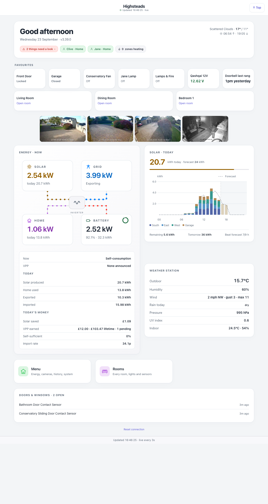
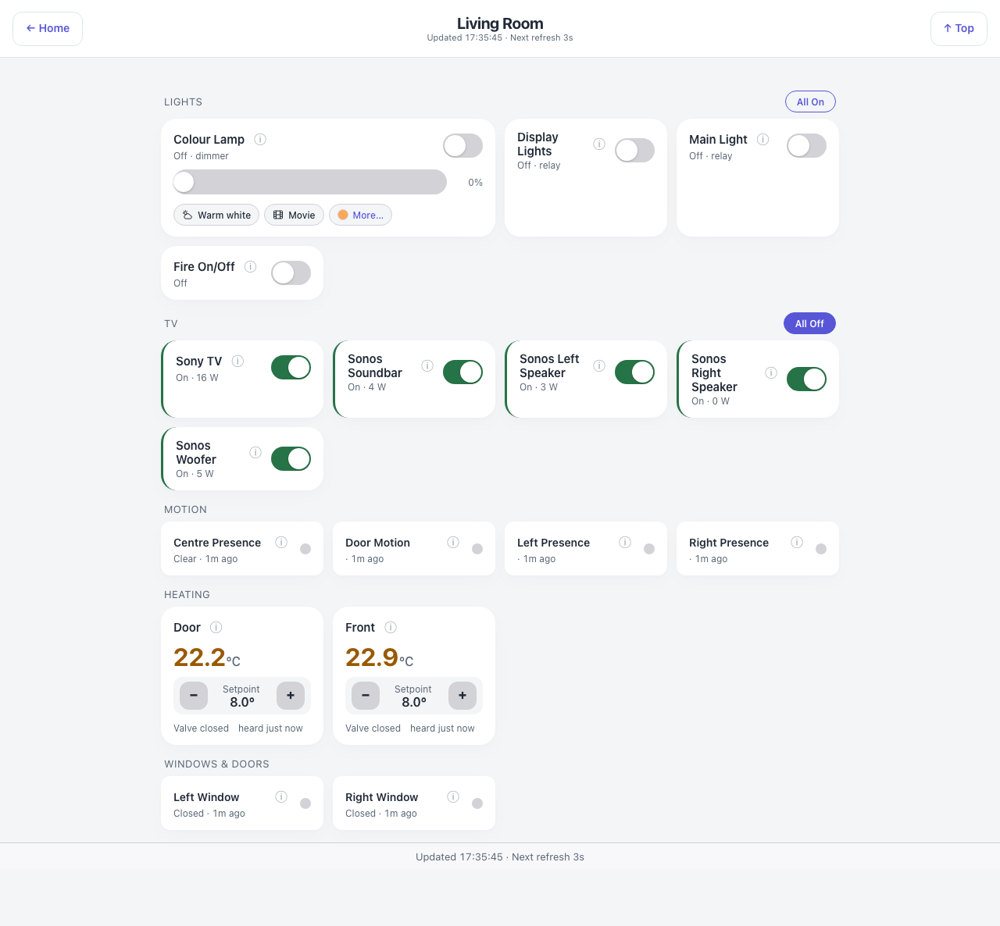
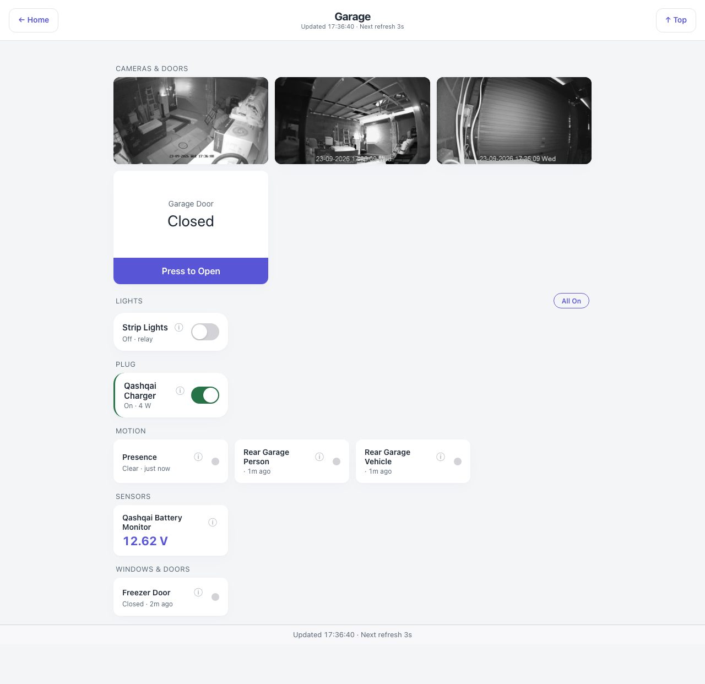
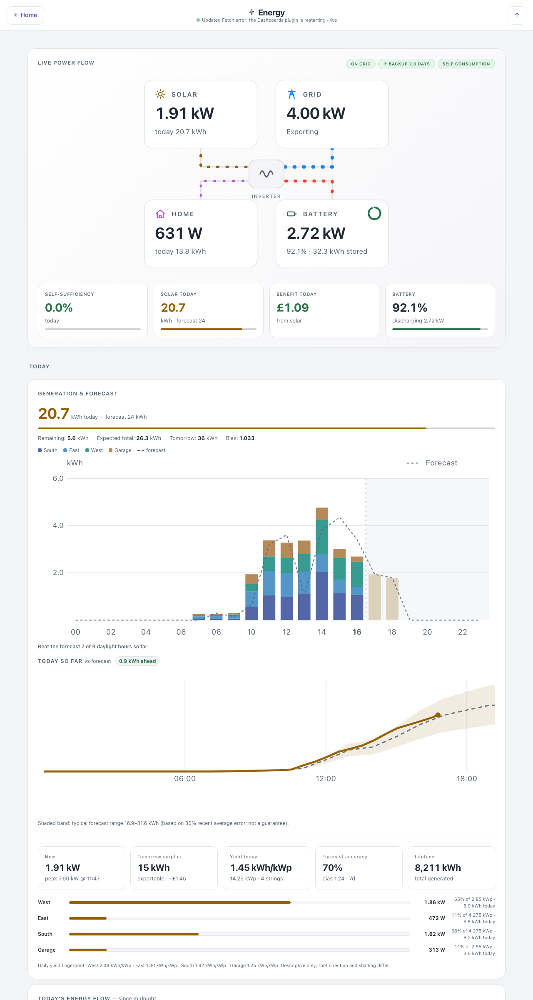
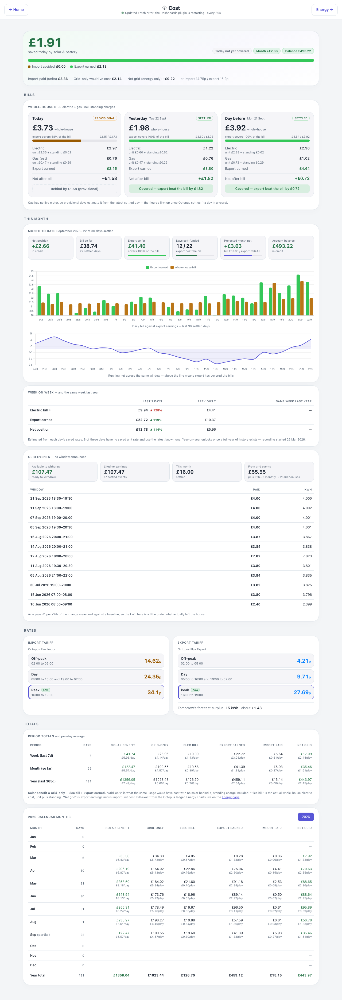
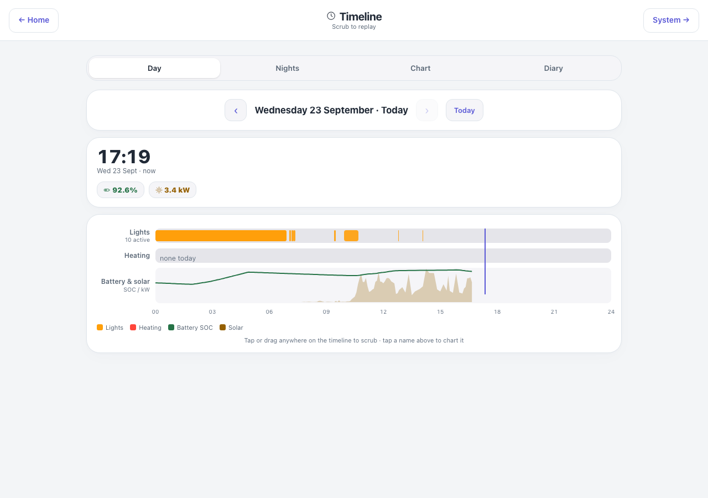
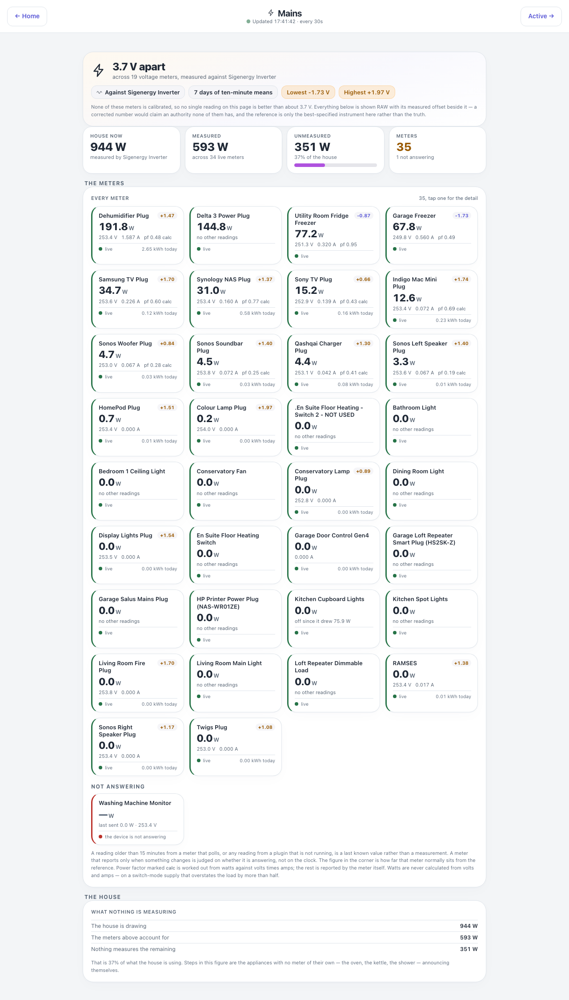

# Dashboards for Indigo

**Your house on a screen — energy, cameras, heating, every room, and the whole day replayed.**

Browser dashboards for [Indigo Domotics](https://www.indigodomo.com/), built for an iPad on the
wall, a phone in your pocket and a Mac on the desk. No app to install, no cloud account,
nothing leaving the house.

  

---

**Version:** 3.46.0

**Documentation:** **[highsteads.github.io/Dashboards](https://highsteads.github.io/Dashboards/)** —
getting started, configuration, a page of notes for every one of the 21 pages, cameras, remote
access, troubleshooting, and the full version history. This README is the short version.

### Jump to

**[What's new](#whats-new)** &nbsp;·&nbsp;
**[A look around](#a-look-around)** &nbsp;·&nbsp;
**[Every page](#every-page)** &nbsp;·&nbsp;
**[Requirements](#requirements)** &nbsp;·&nbsp;
**[Installation](#installation)** &nbsp;·&nbsp;
**[Configuration](#configuration)** &nbsp;·&nbsp;
**[Remote access](#remote-access)** &nbsp;·&nbsp;
**[Claude Code](#building-and-extending-with-claude-code)** &nbsp;·&nbsp;
**[No coding needed](https://highsteads.github.io/Dashboards/no-coding-needed.html)**

---

Pages live under Indigo's `/public/` namespace, so any browser on the LAN — or on the tailnet
when you are away — opens them without typing credentials. The plugin handles all the
camera-side and Indigo-side authentication on the server.

Works in any modern browser: Chrome, Firefox, Safari, Edge and anything Chromium-based. Live
camera video is WebRTC, which every current browser plays with nothing to install. The dashboard ships with a PWA manifest, so on an iPhone or iPad it pins to the home
screen as a proper standalone app (Safari → Share → **Add to Home Screen**), and on a Mac to the
Dock.

**Demo mode** — **[try it online](https://highsteads.github.io/Dashboards/demo/demo.html)**, or open
`demo.html` on any install: every page runs from sanitised sample data with a gentle state
simulator, touching no live devices.

---

**This is one house, not a template.** Every page here is my interpretation of my house — my rooms, my solar and battery, my washing machine. Yours will be different, and they should be. What this shows is what becomes possible when you can describe a page and have it built for you: take the ideas that suit your house, ignore the rest, and ask for the pages you actually want. Every page, the plugin behind it and the documentation site were written by Claude from conversation; nobody typed the code. If you have never done anything like this, **[Start with nothing but Claude](https://highsteads.github.io/Dashboards/no-coding-needed.html)** assumes you have Indigo, a Claude subscription and nothing else, and walks through the lot — installing the plugin, an MCP server, the camera tools and Tailscale — without you writing a line.

**A note on origins.** This started out as a personal plugin built around my own [ClaudeBridge](https://github.com/Highsteads/ClaudeBridge) MCP, which connects Claude Code directly to an Indigo server and is what I use day-to-day to develop and maintain it. That said, you are very welcome to use it with any Indigo MCP setup — it is not tied to ClaudeBridge in any way at runtime. If you do use Claude Code for plugin development, I would strongly recommend loading [Simon's Indigo skills](https://github.com/simons-plugins/indigo-claude-skill) at the start of your session; they bundle the full Indigo SDK reference, lifecycle docs, and worked examples in a form Claude can actually use, and will save you a fair amount of time and tokens compared to piecing it together from the wiki.

---

## What's new

The three most recent releases, word for word. Every release before these is in
**[the version history](docs/changelog.md)**, which the documentation site also carries.

**3.46.0** (25-Sep-2026) - **Safer to share, and honest when something has stopped.** A page whose data has stopped arriving now says so: the green dot beside Updated on the hub, Energy, Cost and System pages turns amber, stops pulsing and reads out of date, as Mains and Meter already did. Alert rules now fire while the hub, a room page, Energy or Alerts is open, not only the Alerts page as before, and two open tabs raise one notification rather than two; a second rule on the same device, such as turns off beside turns on, now fires as well. When notifications cannot be allowed because the dashboards were opened on a plain http address, the Alerts page says that, rather than blaming a browser setting. A new install no longer hands the API key to every browser on the network: each device is paired once with a one-time setup link, and the Connect page says how. An existing install keeps the setting it had, and the log says once why you might switch it off. Guest devices can no longer read Indigo variables unless you list them, the guide now says plainly what a guest can see, and a new menu item, Rotate Guest Link and Camera-Stills Folder, un-pairs every guest device at once and moves the camera pictures to a new secret folder. The shared camera login is now only sent to camera addresses you have approved by pressing Save in Configure, so nobody holding the API key can point a camera at their own server to collect the password; the cameras already running are approved for you. The settings save and the other requests that change something refuse anything a web form on another site could send, the Heating page's boost and force buttons ask for the control PIN as the radiators' own buttons do, a room page's camera works from the keyboard, and the livePoolSize setting, which was ignored, now sets how many cameras can be live. The documentation no longer claims that Refuse the reflector blocks everything (Indigo still serves the dashboard files there), and a few other pages were corrected to match what the dashboards actually do.

**3.45.9** (24-Sep-2026) - **The tap line names the iPhone setting that causes it.** On an iPhone or iPad with Auto-Play Video Previews switched off (Settings, Accessibility, Motion), iOS will not start any video on a web page until the page has been touched, even a silent one. Switching it on makes the cameras go live by themselves, which is what fixed it here. The line under the cameras now says so, and so does the Troubleshooting page, which also no longer claims that only one tile is live away from home.

**3.45.8** (24-Sep-2026) - **Open pages update themselves when the plugin does.** A Safari web app left open on the Mac mini kept running this afternoon's page for hours after newer versions were installed, so it never saw the camera fixes. The plugin now publishes its version in the small file every page already checks every two seconds, and a page that finds itself older reloads once, as soon as it is on screen. If a cached copy brings the old page back, the second attempt asks for it by a new address, and after that it stops, so it can never loop. Pages opened before this version still need one reload by hand, and never again after that.

## A look around

Every one of these is the real house, captured from a live server. Addresses are rewritten to
documentation ranges on the way to the browser, so the pictures are honest without being an
inventory of the network. More on the [documentation site](https://highsteads.github.io/Dashboards/).

 

**A room, end to end.** Lights and sockets with real controls, the blinds, its own sensors and
its own cameras. The Garage carries the door itself — press Open and the button takes over,
counts the seconds and holds until the contact sensors confirm the door has actually moved.

**The whole solar and battery picture.** The power flow at the top really flows — streams of
dots run between the sun, the battery, the house and the grid in the direction the energy is
going, and reverse when the battery turns round. Below it: battery state, tariff, forecast,
per-array generation against a dashed forecast line, and the day's totals.

**What it costs, and when to put the washing on.** Bill-exact daily electricity and gas, standing
charges, export earnings and week-on-week comparisons. The Energy page's When to run it card works
out when to run each metered appliance from the solar forecast, the house's own measured load and
the live half-hourly prices — and tells you plainly when it makes no difference — beside how clean
the grid is now and over the next day.

**Any day, replayed.** Presence, lights, doors and heating on their own lanes with a battery
and solar trace underneath. Drag anywhere on it and the house rebuilds itself at that moment.

 

**Live streams, and every meter in the house.** The cameras are real video, not stills, and slow
themselves right down on a link that is paying by the byte. Mains leads with how far the meters
disagree rather than a reading, because they genuinely span 3.7 volts.

## Every page

Sixteen pages you use, plus five that hold the whole thing together (the menu, Settings, Setup,
Guest and Demo). Every one is a plain HTML
file — no build step, no framework, no bundler — and every one has [a page of notes](https://highsteads.github.io/Dashboards/pages/) on the site.

| Page | What it is for |
|---|---|
| **[Hub](docs/pages/hub.md)** `index.html` | The front page. One chip that says whether anything needs a look, who is home, the heating, your pinned favourites, a strip of cameras (live video where the connection is fast enough, stills otherwise), the battery, the solar day so far, and a power-cut banner when there is one |
| **[Menu](docs/pages/menu.md)** `menu.html` | Every page in one grouped list, with each room as its own entry |
| **[Room](docs/pages/room.md)** `room.html?room=Name` | One room end to end — lights and sockets with real controls, blinds, sensors, cameras, doors |
| **[Active](docs/pages/active.md)** `active.html` | Everything currently on, across the whole house |
| **[Scenes](docs/pages/scenes.md)** `scenes.html` | Every Indigo action group as a button, each reporting what actually happened |
| **[Energy](docs/pages/energy.md)** `energy.html` | The whole solar and battery picture, and when to run the washing (cheapest) and anything else (cleanest grid). Needs SigenEnergyManager, and hides itself without it |
| **[Cost](docs/pages/cost.md)** `cost.html` | What the house costs to run, from bill-exact economics. Needs SigenEnergyManager |
| **[Mains](docs/pages/mains.md)** `mains.html` | Every mains meter and how far each one disagrees with the others |
| **[Meter](docs/pages/meter.md)** `meter.html?id=N` | One meter in detail — live reading, rank, seven-day offset, history |
| **[Timeline](docs/pages/timeline.md)** `timeline.html` | Everything recorded: a day replayed, presence night by night, a chart of any state, and the house diary |
| **[Heating](docs/pages/heating.md)** `heating.html` | Every zone, its temperature and its setpoint, with controls |
| **[Cameras](docs/pages/cameras.md)** `cameras.html` | Every camera as a live stream, tap to enlarge; slows itself on a slow link |
| **[Weather](docs/pages/ecowitt.md)** `ecowitt.html` | The weather station in full |
| **[System](docs/pages/system-health.md)** `system-health.html` | The Indigo server's own vitals, a device-health census, and what the automation is about to do |
| **[Wi-Fi](docs/pages/wifi.md)** `wifi.html` | Every access point and how hard it is working; tap one for [its own page](docs/pages/wifi-ap.md). Needs UniFiHealth |
| **[Alerts](docs/pages/alerts.md)** `alerts.html` | Notification rules from your own browser, no third-party service anywhere |
| **[Settings](docs/pages/settings.md)** `settings.html` | Forms-based configuration — favourites, links, cameras, rooms, scenes, security, raw JSON |
| **[Setup](docs/pages/setup.md)**, **[Guest](docs/pages/guest.md)** and **[Demo](docs/pages/demo.md)** | First-run pairing, read-only pairing, and the fixtures-only demo |

## Requirements

- **Indigo 2025.2** (Python 3.13, IWS 8176)
- **UniFiHealth plugin ≥ v0.2.0** for the Wi-Fi detail pages (optional)
- **EvoHomeControl plugin** for the heating page's boost / force buttons (optional — the panel hides itself when that plugin is not installed; zone temperatures and setpoints work with any thermostat device)
- **SigenEnergyManager plugin** for the Energy page (with its When to run it card), the Cost page and the hub's Energy · Now card (optional — without it those pages hide themselves, the menu drops their tiles and the hub says in one line which plugin is missing; Mains does not need it)
- **SQL Logger plugin** (ships with Indigo) for the Timeline (with its Chart view) and the hub's Home Insights check (optional — not everyone runs it, and everything else works without it, and the pages say so clearly rather than showing empty charts)
- **PostgreSQL** (v2.47.0, optional) — if your SQL Logger writes to PostgreSQL rather than the default SQLite, pick the backend under the plugin's Configure. Reads go through the `psql` command-line client, so **Postgres.app** or the `postgresql` client package must be installed. No Python driver is added, so SQLite users install nothing. Use **Plugins → Dashboards → Test History Connection** to check the settings before relying on them

### Camera grid — both binaries required

The camera grid needs **both** of the following. Without either one the plugin logs a warning and the camera pages show no streams.

- **Homebrew ffmpeg** — `brew install ffmpeg` — go2rtc calls ffmpeg to take the still pictures from each camera's H.264 stream; the camera tiles will not work without it
- **go2rtc** — `brew install go2rtc`, or download `go2rtc_mac_arm64.zip` from [go2rtc releases](https://github.com/AlexxIT/go2rtc/releases) and put the binary anywhere on your PATH. The plugin looks in the path set under **Plugins → Dashboards → Configure** first, then on the PATH, then at `~/bin/go2rtc` as a last resort
- Pillow (thumbnails) and qrcode (setup links) install themselves from `requirements.txt` the first time the plugin starts — nothing to fetch by hand
- IP cameras reachable on the LAN with RTSP enabled (Dahua and Hikvision supported out of the box)

> **Using Claude Code?** [Claude Code](https://claude.ai/claude-code) has built-in shell access and can install both binaries for you — no other plugins or MCP servers needed. Just type:
> 
> *"Install ffmpeg and go2rtc via Homebrew so I can use the Dashboards camera grid"*
> 
> Claude Code will run the Homebrew install and go2rtc download directly on your Mac.

## Installation

> **Using Claude Code?** If you have [Claude Code](https://claude.ai/claude-code) available, you can skip most of the manual steps below — just ask it to install the Dashboards plugin, set up ffmpeg and go2rtc, and configure the credentials. It can handle all of it directly with no other plugins or MCP servers required.

1. Go to the [Releases](https://github.com/Highsteads/Dashboards/releases) page and download `Dashboards.indigoPlugin.zip`
2. Unzip the downloaded file — you will get `Dashboards.indigoPlugin`
3. Double-click `Dashboards.indigoPlugin` — Indigo will install it automatically
4. **Camera grid only** — install both ffmpeg and go2rtc (see Requirements above); the rest of the plugin works without them:
   - `brew install ffmpeg`
   - `brew install go2rtc` (or download the binary from [go2rtc releases](https://github.com/AlexxIT/go2rtc/releases) and set its path under Configure)
5. Configure credentials via **Plugins → Dashboards → Configure** (or via `IndigoSecrets.py` — see Configuration below)
6. Enable the plugin, then pair each browser once: **Plugins → Dashboards → Generate One-Time Setup Link (+QR)** gives a link and a QR code that pair a phone or tablet with nothing to type, or the hub at `http://<indigo-host>:8176/public/dashboards/index.html` takes the API key typed in. From 3.46.0 a new install does not hand the key to every browser on the network by itself; *Auto-seed the API key to LAN browsers* under Configure turns that back on
7. On the Settings page, tick the Indigo device folders that are your rooms — with nothing ticked the plugin uses one house's folder names and yours will show no rooms
8. **Plugins → Dashboards → Test Dashboards Setup** checks the lot and logs a verdict per line

The [Getting started](https://highsteads.github.io/Dashboards/getting-started.html) page walks through all of it, including pairing and guest devices.

## Configuration

The easiest way is the built-in **Settings page** — tap the Settings card on the hub for a
forms-based editor covering favourites, custom links, cameras (including the hub strip), per-room
extras (doors, appliances, TV groups, plugs, hide / include / sort overrides), the Scenes
hide-list and security. The first Save writes `dashboards_config.json` into the plugin's
Preferences folder, and from then on that file is the single source of truth. Camera changes need
a plugin restart; everything else applies immediately.

Credentials live under **Plugins → Dashboards → Configure**: the Indigo API URL and key, the
camera user and password, the OpenWeatherMap key and site coordinates, the carbon region, the
history backend (SQLite or PostgreSQL) and the go2rtc path. `IndigoSecrets.py` is **not** a
requirement — it is simply the approach I use to keep credentials in one place across all my
plugins; if it exists its values take precedence over the matching Configure fields, and the repo
ships `IndigoSecrets_example.py` as a template.

Every key, every room-extras field and every Configure setting is described on the
[Configuration](https://highsteads.github.io/Dashboards/configuration.html) page.

## Remote access

Away from home, run [Tailscale](https://tailscale.com). With it, your phone or laptop is
effectively "at home" anywhere in the world, and the plugin already treats it that way: the
live cameras only work remotely this way (ports 8177 and 8555 are fronted by nothing else), a
setup link pairs a device on the tailnet exactly as at home, and nothing is exposed — no port
forwarding, no public attack surface.

Over Tailscale the Mac answers to its tailnet name, its Tailscale address, or — if the Mac
advertises your home network as a subnet route, which is one setting — the same `192.168.` address
you use at home, so one bookmark works everywhere. Claude Code will install and set Tailscale up
for you if you ask.

The pages also work over the Indigo reflector, which is metered, and my advice is not to use it:
run cameras through it and Indigo Domotics will write to you, then switch it off, as I found out.
A page that can see it was reached that way polls stills at a tenth of the home rate and stops
after ten minutes untouched, and a Configure switch stops the dashboards working over it once you
have Tailscale (Indigo still serves the static files there; only switching the reflector off in
Indigo closes it completely). Details, and the guest-device pairing for a wall tablet, on the
[Remote access](https://highsteads.github.io/Dashboards/remote-access.html) page.

## Ports

| Port | Purpose | Auth |
|---|---|---|
| 8176 | Indigo Web Server — HTML pages served here | None (public namespace) |
| 8177 | Plugin server — WebRTC set-up, pairing | None (trusted LAN / Tailscale; refuses other sources) |
| 1984 | go2rtc HTTP API | Loopback only |
| 8554 | go2rtc RTSP republish | Loopback only |
| 8555 | go2rtc WebRTC media (UDP and TCP) | None (trusted LAN / Tailscale) |

The plugin server and the WebRTC port are intentionally unauthenticated — same trusted-LAN / Tailscale threat model as Indigo's `/public/` namespace. Do not expose port 8177 or 8555 directly to the internet.

## Building and extending with Claude Code

The whole dashboard was built and is maintained through conversation with Claude Code — no
hand-editing of HTML or plugin internals required. *"Add a door control tile to the garage room
page that pulses relay 12345 for 2 seconds"*, *"the garden camera is not showing in the grid —
check the go2rtc config"*, *"install ffmpeg and go2rtc so the camera grid works"*: Claude Code can
read the plugin source, check the Indigo event log through whichever Indigo MCP server you run,
edit pages, restart the plugin and verify the result, all in one conversation.

Claude Code is included in every paid Claude plan — Pro is the cheapest — and in Anthropic
Console accounts with pre-paid credits; it is not on the free plan. On its own it can install the
plugin, the camera tools and Tailscale, and build any page you can describe, but it cannot see
Indigo. Add an Indigo MCP server and it can: "the kitchen light" is enough, it finds the device,
reads the event log, restarts plugins and runs the checks itself. The
[Claude Code and MCP tools](https://highsteads.github.io/Dashboards/claude-code.html) page has the
table of what each part adds.

### The plugin's own Claude tools

From v3.12.0 the bundle ships `Contents/Resources/mcp-manifest.json`, a plugin-provided tool
manifest. An Indigo MCP server that reads those — [mlamoure's Indigo MCP Server](https://github.com/mlamoure/indigo-mcp-server) from v2026.8.1, [Claude Bridge](https://github.com/Highsteads/ClaudeBridge) from v2.26.0 — finds it on its own and lists these tools to Claude, with no configuration on either side:

| Tool | What it does |
|---|---|
| `dashboards_get_status` | Version, hub URL, where the configuration comes from, room folders and how many exist, the camera pipeline, the history backend, which companion scripts are present |
| `dashboards_run_setup_check` | The Test Dashboards Setup sweep, returned as data: every check with its verdict and detail |
| `dashboards_list_room_folders` | The folders that become rooms, whether they are the built-in defaults, every folder Indigo has, and any configured name that does not exist |
| `dashboards_set_room_folders` | Replace the room folders. Unknown names are refused and the real ones listed back. Live at once |
| `dashboards_list_cameras` | The saved cameras, the hub mosaic, whether credentials are set and the streams are running, and whether a restart is pending |
| `dashboards_set_camera` | Add a camera, or change the one with that host. Says whether a restart is needed |
| `dashboards_remove_camera` | Remove a camera, and take it out of the hub mosaic |
| `dashboards_read_log` | The last lines of the plugin's own log, optionally filtered to a phrase |

The writes are refused if the MCP server's "allow plugin-provided tools to make changes" setting is off, and every write goes through the same validation as the Settings page. Reads never return a credential. Without an MCP server the manifest is inert and nothing about the plugin changes. More on the [Claude Code and MCP tools](https://highsteads.github.io/Dashboards/claude-code.html) page.

## Authors & licence

Vibed into existence by **CliveS**, who knew what he wanted, argued until he got it, and tested it on a real house. Typed at inhuman speed by **Claude** (Anthropic), who mostly did as it was told.

© 2026 CliveS · [MIT licence](LICENSE) — copy it, fork it, bend it, break it, fix it, ship it. If it breaks, you get to keep both pieces.
