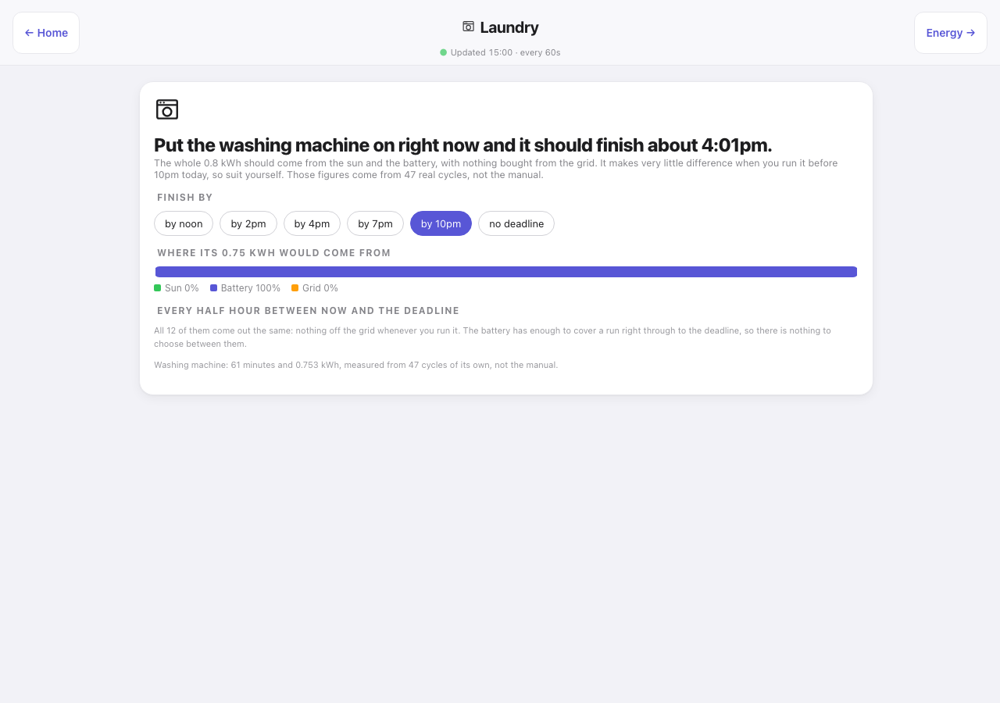

# Dashboards for Indigo

**Your house on a screen — energy, cameras, heating, every room, and the whole day replayed.**

Browser dashboards for [Indigo Domotics](https://www.indigodomo.com/), built for an iPad on the
wall, a phone in your pocket and a Mac on the desk. No app to install, no cloud account,
nothing leaving the house.

  

---

**Version:** 3.32.0

**Documentation:** **[highsteads.github.io/Dashboards](https://highsteads.github.io/Dashboards/)** —
getting started, configuration, a page of notes for every one of the 26 pages, cameras, remote
access, troubleshooting, and the full version history. This README is the short version.

### Jump to

**[What's new](#whats-new)** &nbsp;·&nbsp;
**[A look around](#a-look-around)** &nbsp;·&nbsp;
**[Every page](#every-page)** &nbsp;·&nbsp;
**[Requirements](#requirements)** &nbsp;·&nbsp;
**[Installation](#installation)** &nbsp;·&nbsp;
**[Configuration](#configuration)** &nbsp;·&nbsp;
**[Remote access](#remote-access)** &nbsp;·&nbsp;
**[Claude Code](#building-and-extending-with-claude-code)** &nbsp;·&nbsp;
**[No coding needed](https://highsteads.github.io/Dashboards/no-coding-needed.html)**

---

Pages live under Indigo's `/public/` namespace, so any browser on the LAN — or on the tailnet
when you are away — opens them without typing credentials. The plugin handles all the
camera-side and Indigo-side authentication on the server.

Works in any modern browser: Chrome, Firefox, Safari, Edge and anything Chromium-based. The
camera streams use standard MJPEG in an `` tag, which every browser has handled for
twenty years. The dashboard ships with a PWA manifest, so on an iPhone or iPad it pins to the home
screen as a proper standalone app (Safari → Share → **Add to Home Screen**), and on a Mac to the
Dock.

**Demo mode** — open `demo.html` on any install and every page runs from sanitised sample data
with a gentle state simulator, touching no live devices.

---

**This is one house, not a template.** Every page here is my interpretation of my house — my rooms, my solar and battery, my washing machine. Yours will be different, and they should be. What this shows is what becomes possible when you can describe a page and have it built for you: take the ideas that suit your house, ignore the rest, and ask for the pages you actually want. Every page, the plugin behind it and the documentation site were written by Claude from conversation; nobody typed the code. If you have never done anything like this, **[Start with nothing but Claude](https://highsteads.github.io/Dashboards/no-coding-needed.html)** assumes you have Indigo, a Claude subscription and nothing else, and walks through the lot — installing the plugin, an MCP server, the camera tools and Tailscale — without you writing a line.

**A note on origins.** This started out as a personal plugin built around my own [ClaudeBridge](https://github.com/Highsteads/ClaudeBridge) MCP, which connects Claude Code directly to an Indigo server and is what I use day-to-day to develop and maintain it. That said, you are very welcome to use it with any Indigo MCP setup — it is not tied to ClaudeBridge in any way at runtime. If you do use Claude Code for plugin development, I would strongly recommend loading [Simon's Indigo skills](https://github.com/simons-plugins/indigo-claude-skill) at the start of your session; they bundle the full Indigo SDK reference, lifecycle docs, and worked examples in a form Claude can actually use, and will save you a fair amount of time and tokens compared to piecing it together from the wiki.

---

## What's new

The three most recent releases, word for word. Every release before these is in
**[the version history](docs/changelog.md)**, which the documentation site also carries.

**3.32.0** (23-Sep-2026) - **More of the plugin's code is split into parts. Nothing you can see changes.** The cameras, the settings store, copying the pages into place, the System Health page and the companion-script runner now live in files of their own, and the settings every part shares sit in one small file. The main file goes from about 6,000 lines to under 3,000.

**3.31.0** (23-Sep-2026) - **The companion scripts can be run by a separate plugin.** If the Script Ticker plugin (the one this house uses) is running on the same server, Dashboards leaves the seven companion scripts to it, and runs them itself again within half a minute of it stopping, so a script is never skipped and never run twice. Changing a laundry deadline asks Script Ticker to replan, so the planner never runs in two places at once. The Test Dashboards Setup menu item says which of the two is running them. Nothing changes on a server without Script Ticker. The plugin's status report for Claude also stopped saying the settings came from the old store on every install; it now names the settings file.

**3.30.0** (23-Sep-2026) - **The plugin's code is split into parts, so it is easier to work on. Nothing you can see changes.** The main file had grown to over 8,000 lines. Four features now live in files of their own beside it: the history charts and timeline, the Mains and Meter pages, Home Insights, and the Carbon page. That takes the main file down to about 6,000 lines. Each part checks its own names when the code is linted, so a slip in one of them is caught before it ships rather than when a page asks for it.

## A look around

Every one of these is the real house, captured from a live server. Addresses are rewritten to
documentation ranges on the way to the browser, so the pictures are honest without being an
inventory of the network. More on the [documentation site](https://highsteads.github.io/Dashboards/).

 

**A room, end to end.** Lights and sockets with real controls, the blinds, its own sensors and
its own cameras. The Garage carries the door itself — press Open and the button takes over,
counts the seconds and holds until the contact sensors confirm the door has actually moved.

**The whole solar and battery picture.** The power flow at the top really flows — streams of
dots run between the sun, the battery, the house and the grid in the direction the energy is
going, and reverse when the battery turns round. Below it: battery state, tariff, forecast,
per-array generation against a dashed forecast line, and the day's totals.

 

**What it costs, and when to put the washing on.** Bill-exact daily electricity and gas, standing
charges, export earnings and week-on-week comparisons. Laundry works out when to run each metered
appliance from the solar forecast, the house's own measured load and the live half-hourly prices —
and tells you plainly when it makes no difference.

**Any day, replayed.** Presence, lights, doors and heating on their own lanes with a battery
and solar trace underneath. Drag anywhere on it and the house rebuilds itself at that moment.

 

**Live streams, and every meter in the house.** The cameras are real video, not stills, and slow
themselves right down on a link that is paying by the byte. Mains leads with how far the meters
disagree rather than a reading, because they genuinely span 3.7 volts.

## Every page

Twenty-two pages you use, plus five that hold the whole thing together. Every one is a plain HTML
file — no build step, no framework, no bundler — and every one has [a page of notes](https://highsteads.github.io/Dashboards/pages/) on the site.

| Page | What it is for |
|---|---|
| **[Hub](docs/pages/hub.md)** `index.html` | The front page. Who is home, the heating, the battery, today's carbon, a strip of live cameras, your pinned favourites, the solar day so far, and a power-cut banner when there is one |
| **[Menu](docs/pages/menu.md)** `menu.html` | Every page in one grouped list, with each room as its own entry |
| **[Room](docs/pages/room.md)** `room.html?room=Name` | One room end to end — lights and sockets with real controls, blinds, sensors, cameras, doors |
| **[Active](docs/pages/active.md)** `active.html` | Everything currently on, across the whole house |
| **[Scenes](docs/pages/scenes.md)** `scenes.html` | Every Indigo action group as a button, each reporting what actually happened |
| **[Energy](docs/pages/energy.md)** `energy.html` | The whole solar and battery picture. Needs SigenEnergyManager, and hides itself without it |
| **[Cost](docs/pages/cost.md)** `cost.html` | What the house costs to run, from bill-exact economics. Needs SigenEnergyManager |
| **[Carbon](docs/pages/carbon.md)** `carbon.html` | How dirty the grid is now and over the next day, and when to run a load. Needs nothing |
| **[Laundry](docs/pages/laundry.md)** `laundry.html` | When to run each metered appliance so it costs the least. Advisory only. Needs SigenEnergyManager |
| **[Mains](docs/pages/mains.md)** `mains.html` | Every mains meter and how far each one disagrees with the others |
| **[Meter](docs/pages/meter.md)** `meter.html?id=N` | One meter in detail — live reading, rank, seven-day offset, history |
| **[Timeline](docs/pages/timeline.md)** `timeline.html` | Any day replayed on one scrubbable timeline |
| **[Presence](docs/pages/presence.md)** `presence.html` | Per-night presence-sensor timelines, and whether the sensors agreed |
| **[Activity](docs/pages/activity.md)** `activity.html` | A house diary from the event log, and what the automation is about to do |
| **[Graphs](docs/pages/history.md)** `history.html` | Time-series charts of any recorded device state |
| **[Heating](docs/pages/heating.md)** `heating.html` | Every zone, its temperature and its setpoint, with controls |
| **[Cameras](docs/pages/cameras.md)** `cameras.html` | Every camera as a live stream, tap to enlarge; slows itself on a slow link |
| **[Weather](docs/pages/ecowitt.md)** `ecowitt.html` | The weather station in full |
| **[System](docs/pages/system-health.md)** `system-health.html` | The Indigo server's own vitals and a device-health census |
| **[Wi-Fi](docs/pages/wifi.md)** `wifi.html` | Every access point and how hard it is working; tap one for [its own page](docs/pages/wifi-ap.md). Needs UniFiHealth |
| **[Alerts](docs/pages/alerts.md)** `alerts.html` | Notification rules from your own browser, no third-party service anywhere |
| **[Settings](docs/pages/settings.md)** `settings.html` | Forms-based configuration — favourites, links, cameras, rooms, scenes, security, raw JSON |
| **[Setup](docs/pages/setup.md)**, **[Guest](docs/pages/guest.md)** and **[Demo](docs/pages/demo.md)** | First-run pairing, read-only pairing, and the fixtures-only demo |

## Requirements

- **Indigo 2025.2** (Python 3.13, IWS 8176)
- **UniFiHealth plugin ≥ v0.2.0** for the Wi-Fi detail pages (optional)
- **EvoHomeControl plugin** for the heating page's boost / force buttons (optional — the panel hides itself when that plugin is not installed; zone temperatures and setpoints work with any thermostat device)
- **SigenEnergyManager plugin** for the Energy, Cost and Laundry pages and the hub's Energy · Now card (optional — without it the three pages hide themselves, the menu drops their tiles and the hub says in one line which plugin is missing; Carbon and Mains do not need it)
- **SQL Logger plugin** (ships with Indigo) for the Graphs page, the Timeline and the Home Insights card (optional — not everyone runs it, and everything else works without it, and the pages say so clearly rather than showing empty charts)
- **PostgreSQL** (v2.47.0, optional) — if your SQL Logger writes to PostgreSQL rather than the default SQLite, pick the backend under the plugin's Configure. Reads go through the `psql` command-line client, so **Postgres.app** or the `postgresql` client package must be installed. No Python driver is added, so SQLite users install nothing. Use **Plugins → Dashboards → Test History Connection** to check the settings before relying on them

### Camera grid — both binaries required

The camera grid needs **both** of the following. Without either one the plugin logs a warning and the camera pages show no streams.

- **Homebrew ffmpeg** — `brew install ffmpeg` — go2rtc calls ffmpeg to transcode the camera's H.264 RTSP stream to MJPEG; the camera grid will not work without it
- **go2rtc** — `brew install go2rtc`, or download `go2rtc_mac_arm64.zip` from [go2rtc releases](https://github.com/AlexxIT/go2rtc/releases) and put the binary anywhere on your PATH. The plugin looks in the path set under **Plugins → Dashboards → Configure** first, then on the PATH, then at `~/bin/go2rtc` as a last resort
- Pillow (thumbnails) and qrcode (setup links) install themselves from `requirements.txt` the first time the plugin starts — nothing to fetch by hand
- IP cameras reachable on the LAN with RTSP enabled (Dahua and Hikvision supported out of the box)

> **Using Claude Code?** [Claude Code](https://claude.ai/claude-code) has built-in shell access and can install both binaries for you — no other plugins or MCP servers needed. Just type:
> 
> *"Install ffmpeg and go2rtc via Homebrew so I can use the Dashboards camera grid"*
> 
> Claude Code will run the Homebrew install and go2rtc download directly on your Mac.

## Installation

> **Using Claude Code?** If you have [Claude Code](https://claude.ai/claude-code) available, you can skip most of the manual steps below — just ask it to install the Dashboards plugin, set up ffmpeg and go2rtc, and configure the credentials. It can handle all of it directly with no other plugins or MCP servers required.

1. Go to the [Releases](https://github.com/Highsteads/Dashboards/releases) page and download `Dashboards.indigoPlugin.zip`
2. Unzip the downloaded file — you will get `Dashboards.indigoPlugin`
3. Double-click `Dashboards.indigoPlugin` — Indigo will install it automatically
4. **Camera grid only** — install both ffmpeg and go2rtc (see Requirements above); the rest of the plugin works without them:
   - `brew install ffmpeg`
   - `brew install go2rtc` (or download the binary from [go2rtc releases](https://github.com/AlexxIT/go2rtc/releases) and set its path under Configure)
5. Configure credentials via **Plugins → Dashboards → Configure** (or via `IndigoSecrets.py` — see Configuration below)
6. Enable the plugin and open `http://<indigo-host>:8176/public/dashboards/index.html`. The hub asks for your Indigo API key once and keeps it in that browser; **Plugins → Dashboards → Generate One-Time Setup Link (+QR)** pairs a phone without typing it
7. On the Settings page, tick the Indigo device folders that are your rooms — with nothing ticked the plugin uses one house's folder names and yours will show no rooms
8. **Plugins → Dashboards → Test Dashboards Setup** checks the lot and logs a verdict per line

The [Getting started](https://highsteads.github.io/Dashboards/getting-started.html) page walks through all of it, including pairing and guest devices.

## Configuration

The easiest way is the built-in **Settings page** — tap the Settings card on the hub for a
forms-based editor covering favourites, custom links, cameras (including the hub strip), per-room
extras (doors, appliances, TV groups, plugs, hide / include / sort overrides), the Scenes
hide-list and security. The first Save writes `dashboards_config.json` into the plugin's
Preferences folder, and from then on that file is the single source of truth. Camera changes need
a plugin restart; everything else applies immediately.

Credentials live under **Plugins → Dashboards → Configure**: the Indigo API URL and key, the
camera user and password, the OpenWeatherMap key and site coordinates, the carbon region, the
history backend (SQLite or PostgreSQL) and the go2rtc path. `IndigoSecrets.py` is **not** a
requirement — it is simply the approach I use to keep credentials in one place across all my
plugins; if it exists its values take precedence over the matching Configure fields, and the repo
ships `IndigoSecrets_example.py` as a template.

Every key, every room-extras field and every Configure setting is described on the
[Configuration](https://highsteads.github.io/Dashboards/configuration.html) page.

## Remote access

Away from home, run [Tailscale](https://tailscale.com). With it, your phone or laptop is
effectively "at home" anywhere in the world, and the plugin already treats it that way: the
cameras only work remotely this way (the MJPEG proxy on port 8177 is fronted by nothing else), a
new browser on the tailnet pairs itself on first visit, and nothing is exposed — no port
forwarding, no public attack surface.

Over Tailscale the Mac answers to its tailnet name, its Tailscale address, or — if the Mac
advertises your home network as a subnet route, which is one setting — the same `192.168.` address
you use at home, so one bookmark works everywhere. Claude Code will install and set Tailscale up
for you if you ask.

The pages also work over the Indigo reflector, which is metered, and my advice is not to use it:
run cameras through it and Indigo Domotics will write to you, then switch it off, as I found out.
A page that can see it was reached that way polls stills at a tenth of the home rate and stops
after ten minutes untouched, and a Configure switch refuses the reflector altogether once you have
Tailscale. Details, and the guest-device pairing for a wall tablet, on the
[Remote access](https://highsteads.github.io/Dashboards/remote-access.html) page.

## Ports

| Port | Purpose | Auth |
|---|---|---|
| 8176 | Indigo Web Server — HTML pages served here | None (public namespace) |
| 8177 | Plugin MJPEG proxy — live camera streams | None (trusted LAN / Tailscale) |
| 1984 | go2rtc HTTP API | None |
| 8554 | go2rtc RTSP republish | None |
| 8555 | go2rtc WebRTC media (TCP) | None |

The MJPEG proxy and go2rtc ports are intentionally unauthenticated — same trusted-LAN / Tailscale threat model as Indigo's `/public/` namespace. Do not expose port 8177 directly to the internet.

## Building and extending with Claude Code

The whole dashboard was built and is maintained through conversation with Claude Code — no
hand-editing of HTML or plugin internals required. *"Add a door control tile to the garage room
page that pulses relay 12345 for 2 seconds"*, *"the garden camera is not showing in the grid —
check the go2rtc config"*, *"install ffmpeg and go2rtc so the camera grid works"*: Claude Code can
read the plugin source, check the Indigo event log through whichever Indigo MCP server you run,
edit pages, restart the plugin and verify the result, all in one conversation.

Claude Code is included in every paid Claude plan — Pro is the cheapest — and in Anthropic
Console accounts with pre-paid credits; it is not on the free plan. On its own it can install the
plugin, the camera tools and Tailscale, and build any page you can describe, but it cannot see
Indigo. Add an Indigo MCP server and it can: "the kitchen light" is enough, it finds the device,
reads the event log, restarts plugins and runs the checks itself. The
[Claude Code and MCP tools](https://highsteads.github.io/Dashboards/claude-code.html) page has the
table of what each part adds.

### The plugin's own Claude tools

From v3.12.0 the bundle ships `Contents/Resources/mcp-manifest.json`, a plugin-provided tool
manifest. An Indigo MCP server that reads those — [mlamoure's Indigo MCP Server](https://github.com/mlamoure/indigo-mcp-server) from v2026.8.1, [Claude Bridge](https://github.com/Highsteads/ClaudeBridge) from v2.26.0 — finds it on its own and lists these tools to Claude, with no configuration on either side:

| Tool | What it does |
|---|---|
| `dashboards_get_status` | Version, hub URL, where the configuration comes from, room folders and how many exist, the camera pipeline, the history backend, which companion scripts are present |
| `dashboards_run_setup_check` | The Test Dashboards Setup sweep, returned as data: every check with its verdict and detail |
| `dashboards_list_room_folders` | The folders that become rooms, whether they are the built-in defaults, every folder Indigo has, and any configured name that does not exist |
| `dashboards_set_room_folders` | Replace the room folders. Unknown names are refused and the real ones listed back. Live at once |
| `dashboards_list_cameras` | The saved cameras, the hub mosaic, whether credentials are set and the streams are running, and whether a restart is pending |
| `dashboards_set_camera` | Add a camera, or change the one with that host. Says whether a restart is needed |
| `dashboards_remove_camera` | Remove a camera, and take it out of the hub mosaic |
| `dashboards_read_log` | The last lines of the plugin's own log, optionally filtered to a phrase |

The writes are refused if the MCP server's "allow plugin-provided tools to make changes" setting is off, and every write goes through the same validation as the Settings page. Reads never return a credential. Without an MCP server the manifest is inert and nothing about the plugin changes. More on the [Claude Code and MCP tools](https://highsteads.github.io/Dashboards/claude-code.html) page.

## Authors & licence

Vibed into existence by **CliveS**, who knew what he wanted, argued until he got it, and tested it on a real house. Typed at inhuman speed by **Claude** (Anthropic), who mostly did as it was told.

© 2026 CliveS · [MIT licence](LICENSE) — copy it, fork it, bend it, break it, fix it, ship it. If it breaks, you get to keep both pieces.
