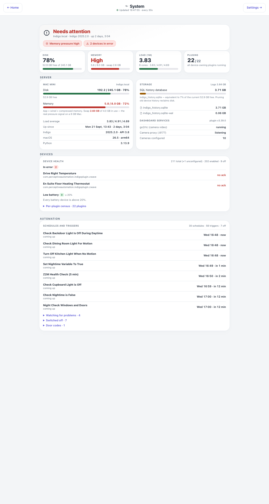

# Dashboards for Indigo

**Your house on a screen — energy, cameras, heating, every room, and the whole day replayed.**

Browser dashboards for [Indigo Domotics](https://www.indigodomo.com/), built for an iPad on the
wall, a phone in your pocket and a Mac on the desk. No app to install, no cloud account, nothing
leaving the house.

Pages live under Indigo's `/public/` namespace, so any browser on the LAN — or on the tailnet
when you are away — opens them without typing credentials. The plugin handles all the camera-side
and Indigo-side authentication on the server. It works in any modern browser: Chrome, Firefox,
Safari, Edge and anything Chromium-based.

## One house, not a template

**Everything here is my interpretation of my house.** The rooms are mine, the energy pages exist
because I have solar and a battery, the Laundry page because I was tired of guessing when to put
the washing on. Yours will be different, and they should be. Nothing on this site is a shape you
have to fit into — it shows what is possible when you can describe a page and have it built, and
the right way to use it is to take the ideas that suit your house, ignore the rest, and ask for
the pages you actually want.

Every page here, the plugin behind it and these docs were written by Claude from conversation.
Nobody typed the code. If that sounds out of reach, start at
**[Start with nothing but Claude](no-coding-needed.md)** — it assumes you have Indigo, a Claude
subscription and nothing else.

## Start here

| | |
|---|---|
| **[Start with nothing but Claude](no-coding-needed.md)** | For a complete beginner: install Claude Code, then have it install the plugin, an MCP server, the camera tools and Tailscale, and build your own pages. No coding, ever |
| **[Getting started](getting-started.md)** | What you need, how to install it, and how a browser gets paired |
| **[Configuration](configuration.md)** | The Settings page, the Configure dialog, cameras, rooms and every config key |
| **[Using the dashboards](using.md)** | What moves, what you can tap, the live dot, PIN and guest access |
| **[Every page](pages/index.md)** | One page of notes for each of the 27 pages — what is on it, where the numbers come from, what you can do |
| **[Cameras](cameras.md)** | How H.264 becomes a picture in an `` tag, and what it costs on a slow link |
| **[Remote access](remote-access.md)** | Tailscale, the ports, guest devices, and why the reflector is treated as somebody else's money |
| **[Claude Code and MCP tools](claude-code.md)** | What Claude Code adds, what an MCP server adds on top, and the tools the plugin offers to any Indigo MCP server |
| **[How it is built](architecture.md)** | Page files, the data endpoints, the shared scripts and the test suite |
| **[Troubleshooting](troubleshooting.md)** | The setup check, and the things that go wrong most often |
| **[Version history](changelog.md)** | Every release, newest first |

Download the plugin from the [Releases page](https://github.com/Highsteads/Dashboards/releases);
the source is on [GitHub](https://github.com/Highsteads/Dashboards).

## A look around

Every one of these is a real house, captured from a live server. Addresses are rewritten to
documentation ranges on the way to the browser, so the pictures are honest without being an
inventory of the network.

 

**A room, end to end.** Lights and sockets with real controls, the blinds, its own sensors and
its own cameras. The Garage carries the door itself — press Open and the button takes over, counts
the seconds and holds until the contact sensors confirm the door has actually moved.

**The whole solar and battery picture.** The power flow at the top really flows — streams of dots
run between the sun, the battery, the house and the grid in the direction the energy is going, and
reverse when the battery turns round. Below it: battery state, tariff, forecast, per-array
generation against a dashed forecast line, and the day's totals.

 

**What it costs and what it costs the planet.** Bill-exact daily electricity and gas, standing
charges, export earnings and week-on-week comparisons. Carbon is live national grid intensity with
a plain-English verdict on whether now is a good time to run a load.

**Any day, replayed.** Presence, lights, doors and heating on their own lanes with a battery and
solar trace underneath. Drag anywhere on it and the house rebuilds itself at that moment.

 

**Live streams, and the server's own vitals.** The cameras are real video, not stills, and slow
themselves right down on a link that is paying by the byte. System health is disk, memory and swap
pressure, load, uptime, the history database's size, and a census of every device that is in error,
low on battery or has gone quiet.

The rest are on their own pages under [Every page](pages/index.md).

## Demo mode

Open `demo.html` on any install and every page runs from sanitised sample data with a gentle state
simulator, touching no live devices. It is the quickest way to see the whole thing before you
configure a single room.

## A note on origins

This started out as a personal plugin built around my own
[ClaudeBridge](https://github.com/Highsteads/ClaudeBridge) MCP, which connects Claude Code directly
to an Indigo server and is what I use day-to-day to develop and maintain it. That said, you are very
welcome to use it with any Indigo MCP setup — it is not tied to ClaudeBridge in any way at runtime.
If you do use Claude Code for plugin development, I would strongly recommend loading
[Simon's Indigo skills](https://github.com/simons-plugins/indigo-claude-skill) at the start of your
session; they bundle the full Indigo SDK reference, lifecycle docs and worked examples in a form
Claude can actually use.
