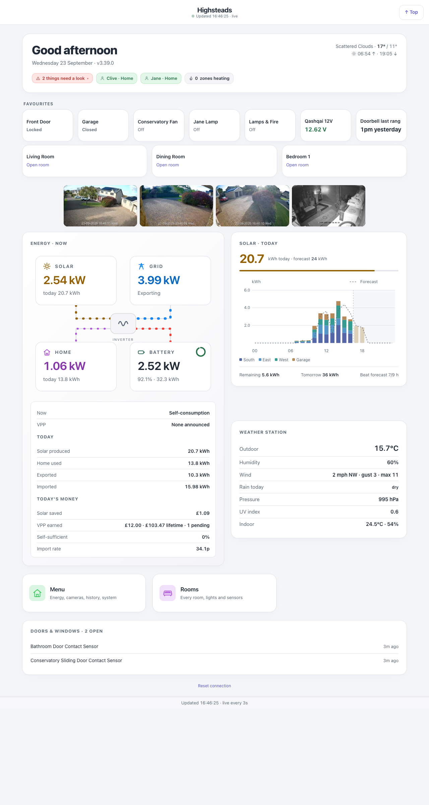
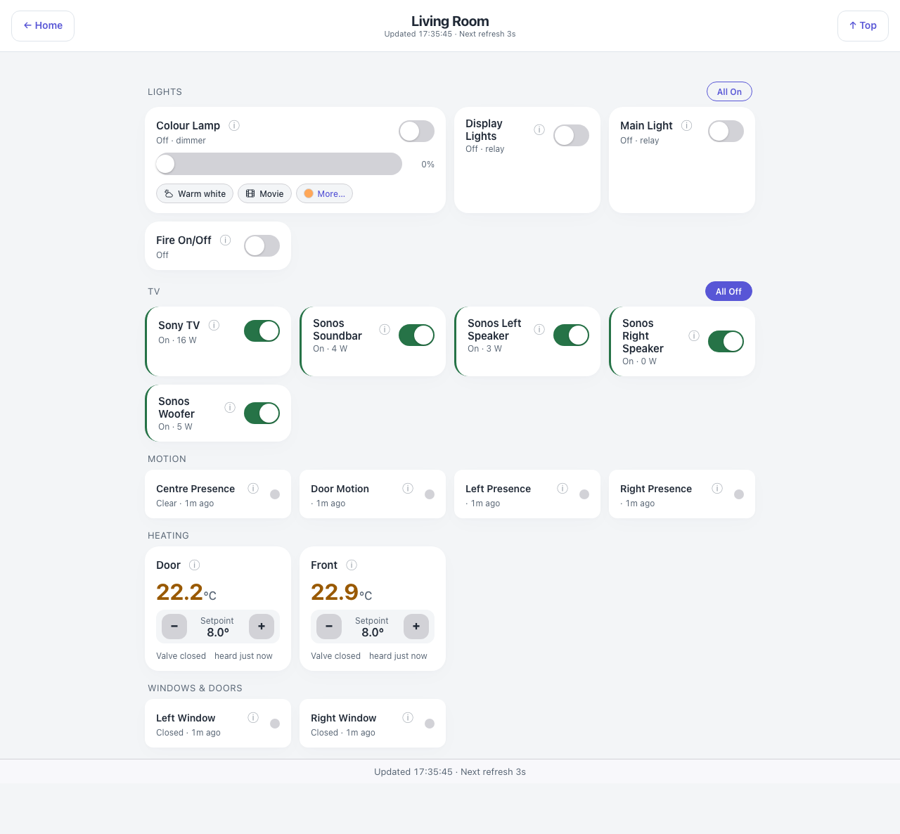
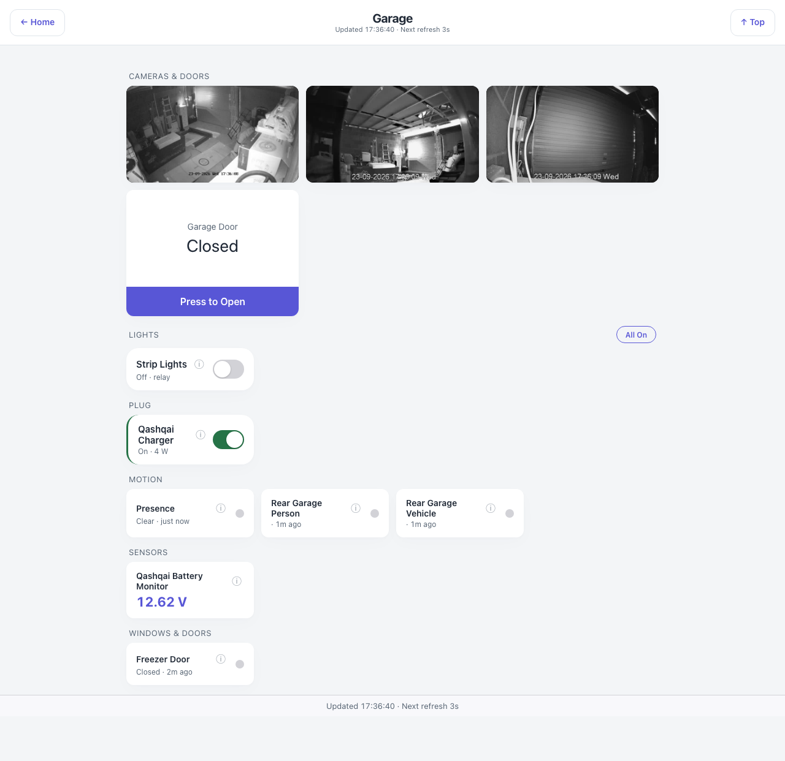
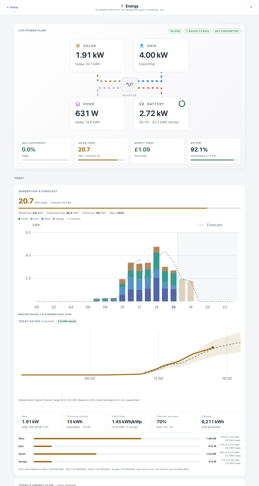
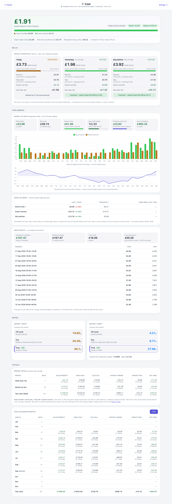
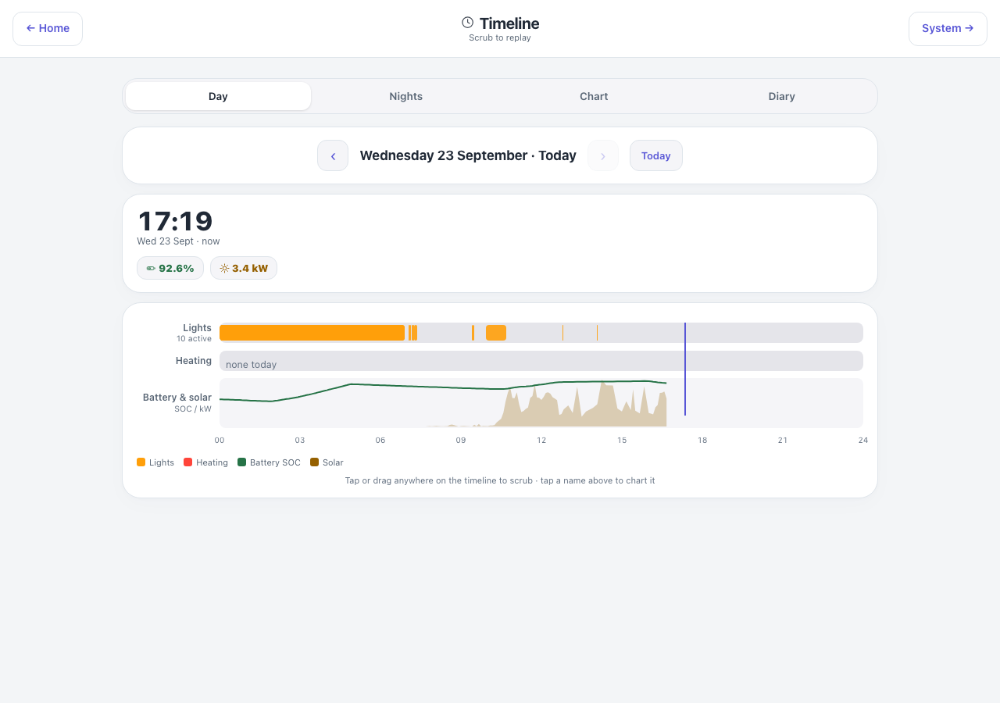
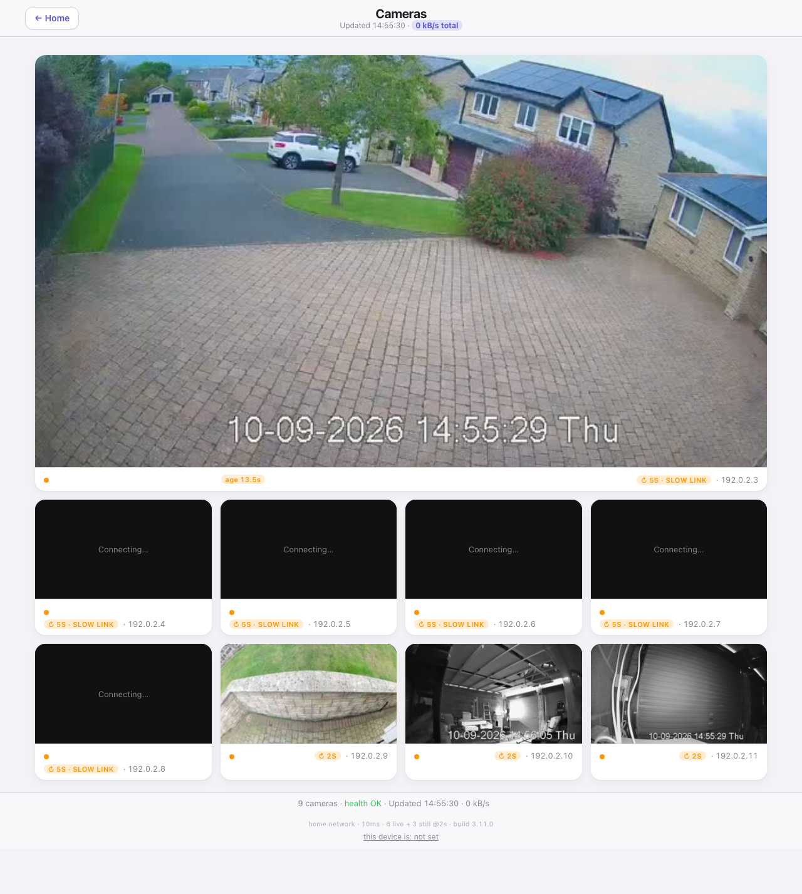
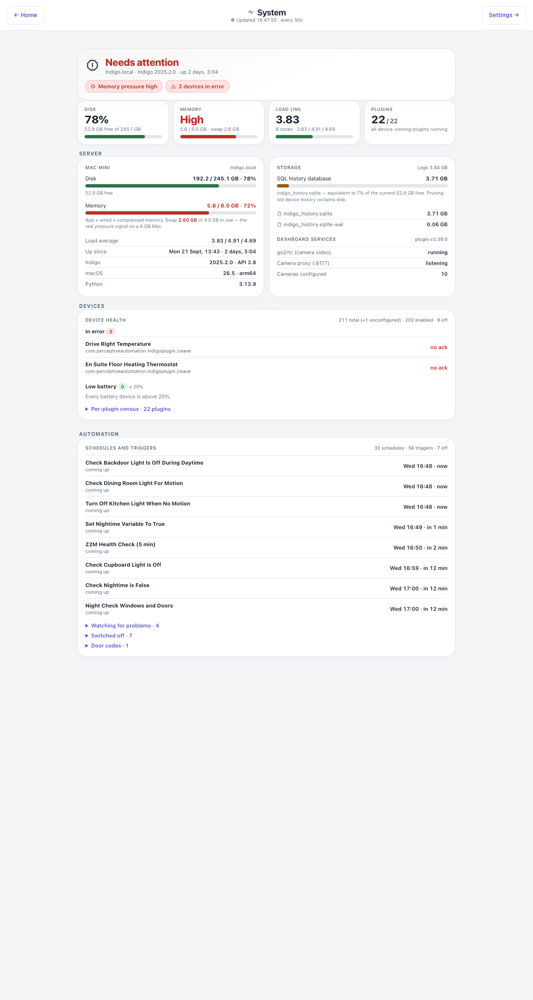

# Dashboards for Indigo

**Your house on a screen — energy, cameras, heating, every room, and the whole day replayed.**

Browser dashboards for [Indigo Domotics](https://www.indigodomo.com/), built for an iPad on the
wall, a phone in your pocket and a Mac on the desk. No app to install, no cloud account, nothing
leaving the house.

## Watch a four-minute tour

<video controls preload="metadata" width="860" poster="video/tour-poster.jpg" style="max-width:100%;height:auto">
  <source src="video/tour.mp4" type="video/mp4">
  <track kind="captions" src="video/tour.vtt" srclang="en" label="English" default>
</video>

A real house, filmed live with every press real: the garage door opening and closing with its
tile changing colour, the cameras, the kitchen lights, the heating, the energy page and the rest
of the menu. Turn the sound on for the commentary, or use the captions.

Indigo's own web server hands out the pages, so any browser on your home network — or on
[Tailscale](remote-access.md) when you are away — can open them once it has been paired, and the
plugin looks after the camera logins on the Indigo Mac. It works in Chrome, Firefox, Safari, Edge and
any other current browser.

## One house, not a template

**Everything here is my interpretation of my house.** The rooms are mine, the energy pages exist
because I have solar and a battery, the When to run it card because I was tired of guessing when to put
the washing on. Yours will be different, and they should be. Nothing on this site is a shape you
have to fit into — it shows what is possible when you can describe a page and have it built, and
the right way to use it is to take the ideas that suit your house, ignore the rest, and ask for
the pages you actually want.

Every page here, the plugin behind it and these docs were written by Claude from conversation.
Nobody typed the code. If that sounds out of reach, start at
**[Start with nothing but Claude](no-coding-needed.md)** — it assumes you have Indigo, a Claude
subscription and nothing else.

## Where to go next

| If you want to... | Read |
|---|---|
| Have Claude Code do all the setting up for you, with no coding | [Start with nothing but Claude](no-coding-needed.md) |
| Install the plugin, pair a browser and see your first rooms | [Getting started](getting-started.md) |
| Know what moves, what you can tap, and how alerts and the PIN work | [Using the dashboards](using.md) |
| Know what every card and tile on each page means — one page of notes for each of the 20 pages | [Every page](pages/index.md) |
| Understand what goes on behind the scenes, in plain words | [How it works](how-it-works.md) |
| Know what every setting does | [Configuration](configuration.md) |
| Know what each item in the Plugins menu does | [The plugin menu](plugin-menu.md) |
| Set up the cameras, and know what they cost on a slow connection | [Cameras](cameras.md) |
| Use the dashboards away from home, or give a guest a look | [Remote access](remote-access.md) |
| Know what Claude Code and an Indigo MCP server can do with the plugin | [Claude Code and MCP tools](claude-code.md) |
| Sort out a problem | [When something goes wrong](troubleshooting.md) |
| See what changed in each version | [Version history](changelog.md) |
| Read the file names, data sources and tests behind it all | [Technical notes](architecture.md) |

Download the plugin from the [Releases page](https://github.com/Highsteads/Dashboards/releases/latest).
The source is on [GitHub](https://github.com/Highsteads/Dashboards).

## A look around

Every one of these is a real house, captured from a live server. Addresses are rewritten to
documentation ranges on the way to the browser, so the pictures are honest without being an
inventory of the network.

 

**A room, end to end.** Lights and sockets with real controls, the blinds, its own sensors and
its own cameras. The Garage carries the door itself — press Open and the button takes over, counts
the seconds and holds until the contact sensors confirm the door has actually moved.

**The whole solar and battery picture.** The power flow at the top really flows — streams of dots
run between the sun, the battery, the house and the grid in the direction the energy is going, and
reverse when the battery turns round. Below it: battery state, tariff, forecast, per-array
generation against a dashed forecast line, and the day's totals.

**What it costs and what it costs the planet.** Bill-exact daily electricity and gas, standing
charges, export earnings and week-on-week comparisons. On the Energy page, When to run it says when
to put the washing on for the least money, and how clean the grid is now and over the next day.

**Any day, replayed.** Presence, lights, doors and heating on their own lanes with a battery and
solar trace underneath. Drag anywhere on it and the house rebuilds itself at that moment.

 

**Live streams, and the server's own vitals.** The cameras are real video, not stills, and slow
themselves right down on a link that is paying by the byte. System health is disk, memory and swap
pressure, load, uptime, the history database's size, and a census of every device that is in error,
low on battery or has gone quiet.

The rest are on their own pages under [Every page](pages/index.md).

## A note on origins

This started out as a personal plugin built around my own
[ClaudeBridge](https://github.com/Highsteads/ClaudeBridge) MCP, which connects Claude Code directly
to an Indigo server and is what I use day-to-day to develop and maintain it. That said, you are very
welcome to use it with any Indigo MCP setup — it is not tied to ClaudeBridge in any way at runtime.
If you do use Claude Code for plugin development, I would strongly recommend loading
[Simon's Indigo skills](https://github.com/simons-plugins/indigo-claude-skill) at the start of your
session. They bundle the full Indigo SDK reference, lifecycle docs and worked examples in a form
Claude can actually use.
