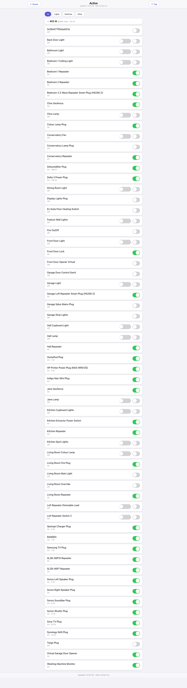

# Active — `active.html`

A flat alphabetical list of everything that can be switched, with a working control on every row.
When you want to turn something off and cannot remember which room it counts as, this is the page.

## Down the page

**Header.** Title, last update, refresh countdown, and a "Top" button.

**Filter pills.** All, Lights, Switches, Other.

**Power strip.** Total watts being drawn right now across the devices that report it, and how many
are on.

**The list.** One row per device: the name, a status line ("On", "Off", or "On · 5 W" where the
device measures its own draw), and the control on the right. A dimmable device gets a dimmer and an
on/off; a plain relay gets one switch.

## Where the data comes from

Indigo's `/v2/api` through the shared delta cache, with the plugin's `changedSince` endpoint keeping
the traffic down to devices that have actually moved. Which control a device gets is decided by its
capability (`supportsOnState`), never by its name — a guard shaped like a device name silently
disarms itself the day the device is renamed.

## Refresh

Every 3 s.

## What you can do here

Toggle or dim anything in the list. A toggle is confirmed from the device, not assumed: a device
whose communication is disabled, or whose plugin has stopped, swallows a command without an error,
so the page checks back a few seconds later and reverts the switch with a warning if the device
disagrees. Controls honour the PIN where the device is on the protected list, and a guest-paired
browser sees the page read-only.

## Worth knowing

- The wattage in the strip only counts devices that report power. It is a floor, not a house-wide
  figure — the whole-house number is on the Energy page.
- Some rows are things you would not want to toggle. A freezer's monitoring plug is a relay too,
  and switching it off is a bad afternoon. Put such devices on the PIN list, or hide them from the
  room pages with the room extras.
