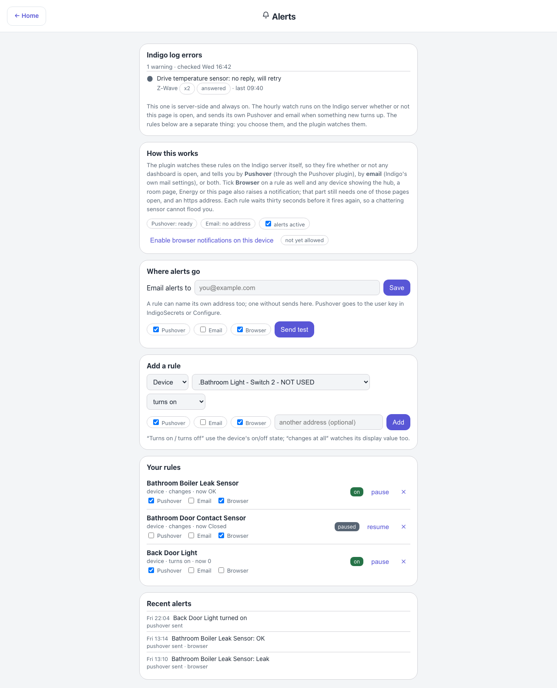

# Alerts — `alerts.html`

Two different things sit on this page, and the copy works hard to keep them apart: a server-side
watch that is always on, and per-browser notification rules that only work while a page that
watches them is open: the hub, a room page, Energy or this one.

## Down the page

**Indigo log errors.** The verdict from the hourly event-log watch, headed with the counts and the
time it last ran. Each row is one collapsed signature: a red or amber dot, the message, the source
plugin, a repeat-count badge where it has repeated, and when it was last seen. The badges are the
useful part — an unreachable plug appearing two hundred times overnight is one fault rather than two
hundred. The paragraph under it is the important one: this watch is server-side and always on, it
runs whether or not the page is open, and it sends its own notifications when something new turns
up. The rules further down are a separate thing.

**How this works.** What the rules below actually are, said plainly, including the limitation:
there is no cloud push service behind them, so when the hub, the room pages, Energy and Alerts are
all closed in this browser the notifications stop. It suits a wall tablet, a kiosk or a pinned tab,
and nothing else. Then a button to enable notifications on this device, a badge showing the
browser's current permission state, and an "alerts active" tick, which is remembered. On a plain
`http://` address the badge reads "needs an https address" and a line underneath explains why:
browsers only offer notifications to a secure page (see
[Notifications and install need HTTPS](../remote-access.md#notifications-and-install-need-https)).

**Add a rule.** Pick Device or Variable, choose one from the list, choose the condition — turns on,
turns off, or changes at all — and Add. Turns on and turns off use the device's on/off state, while
"changes at all" watches its display value too.

**Your rules.** The rules on this browser, with an empty state when there are none.

**Recent alerts.** What has fired on this browser, from whichever page raised it.

## Where the data comes from

| Part | Source |
|---|---|
| The log-error verdict | `logErrors` — the state file the hourly `Log_Error_Watch.py` companion script writes |
| The device and variable pickers | Indigo `/v2/api` |
| The rules, and what has fired | `localStorage` on this browser, shared with the other pages that watch the rules (`dashboards-alerts.js`) |

Notifications are raised through the service worker, because Android Chrome requires
`registration.showNotification()` rather than a bare `Notification`.

## Refresh

Rules are evaluated every 3 s against the device cache (variables every 10 s), by one open tab at
a time: this page always evaluates, and a hub, room or Energy tab stands by while another tab is
doing it. A change two tabs both see is announced once. The log-error card refreshes every five
minutes.

## What you can do here

- Grant notification permission for this browser.
- Add, list and remove rules.
- Turn all rules off with the "alerts active" tick without deleting them.

## Worth knowing

- Rules are per-browser and stored in that browser. Clearing site data loses them, and they do not
  follow you to another device.
- The distinction at the top of the page is the one that catches people out. Deleting every rule
  here does not stop the server-side watch's own notifications.
- Each rule has a thirty-second cooldown, so a chattering sensor cannot spam you.
