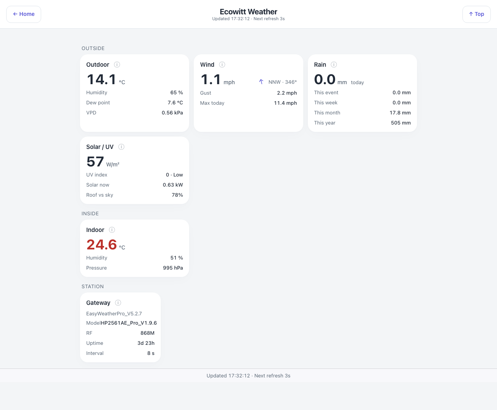

# Weather — `ecowitt.html`

The local weather station rather than a forecast. The hub shows OpenWeatherMap; this page shows what
the kit in the garden is actually measuring, from any weather device that exposes states in Indigo —
an Ecowitt station through the Ecowitt plugin is what it was built on.

## Down the page

**Outside.**

- *Outdoor* — temperature large, then humidity, dew point and vapour-pressure deficit.
- *Wind* — current speed with a direction arrow and compass bearing, gust, and today's maximum.
- *Rain* — today's total large, then this event, this week, this month and this year.
- *Solar / UV* — irradiance in W/m², the UV index with a band, and the array's current output. In
  daylight a fourth row appears, "roof vs sky": what the roof is producing as a percentage of what
  the sky irradiance implies (set `arrayKwp` in the configuration). It is absent after dark, when
  a ratio of nothing to nothing would be a number that means nothing. The array's output and the
  roof-vs-sky row need SigenEnergyManager and are left out without it, so the card then shows the
  station's own readings only.

**Inside.** Indoor temperature, humidity and pressure.

**Station.** Gateway firmware, model, RF band, uptime and reporting interval.

Every card has an info button that opens the underlying Indigo device.

## Where the data comes from

Indigo devices published by the weather plugin, read through `/v2/api`. Solar output for the
cross-check comes from the energy plugin. Units are read from the plugin's own unit states and
converted from whichever it publishes; an unrecognised unit shows nothing rather than a wrong number.

## Refresh

Every 3 s. The station itself reports on its own interval, which the Station card states. A stale
card dims rather than sitting there looking current, and the refresh timestamp only advances on an
actual successful poll.

## What you can do here

Open the info panel on any card. No controls — a weather station has nothing to switch.

## Worth knowing

- "Roof vs sky" compares measured irradiance against measured generation, so a figure sitting well
  below 100% on a clear day points at shading, soiling or a string down rather than at the weather.
  Above 100% is normal in bright broken cloud, when the panels see edge-of-cloud enhancement the
  pyranometer does not.
- Rain "this event" resets after a dry gap, so it is not the same as "today".
- A reading of exactly 0.0 that never changes is worth suspecting. A plugin state that has never
  been written is born at zero, and 0.0 °C is a plausible dew point — this page is how one such
  fault was caught.
