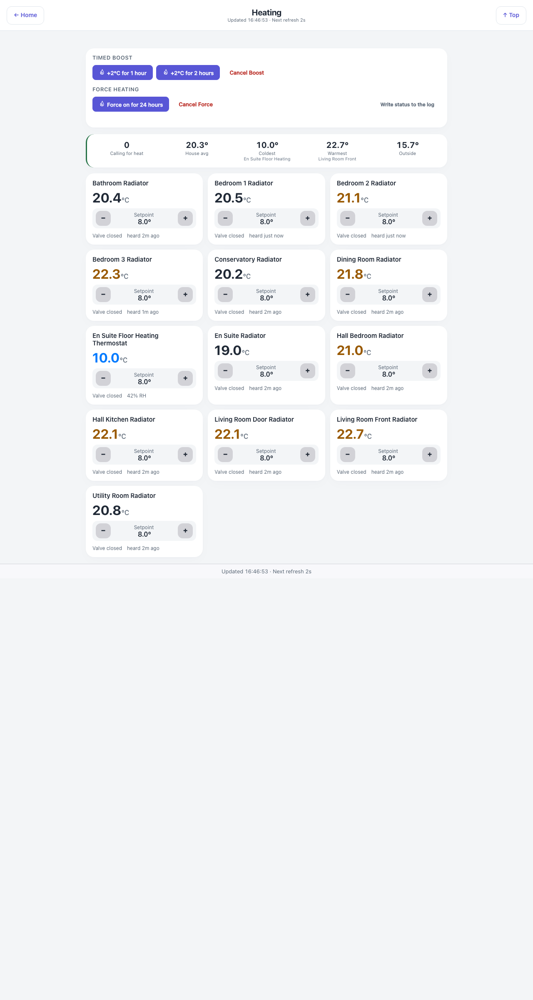

# Heating — `heating.html`

Every radiator zone with its live temperature and a working setpoint control, plus the two
whole-house overrides where the heating plugin supports them.

## Down the page

**Controls card.** Drawn only when the EvoHomeControl plugin is installed and enabled — the buttons
are wired to that plugin's own actions. Two rows: *Timed boost* (+2 °C for one hour, +2 °C for two
hours, Cancel boost) and *Force heating* (force on for 24 hours, Cancel force, and a link that
writes the current heating state into the Indigo event log). Each of them asks for the control
PIN, once per session, when any heating zone on the page is on the PIN list (Settings → Security),
as the zones' own buttons do; before 3.46.0 they skipped it.

**Summary strip.** Zones calling for heat, the house average, the coldest zone with its name, the
warmest with its name, and the outside temperature. A coloured edge on the strip reflects whether
anything is calling.

**Zone grid.** One card per zone: the name, the current temperature large, a setpoint stepper with
minus and plus, the valve state, and how long ago the zone was last heard from. A zone at an unusual
temperature is coloured — blue when cold, amber when warm — so the grid reads at a glance.

**Footer.** Last update and the refresh cadence.

## Where the numbers come from

| Part | Source |
|---|---|
| Zone temperatures, setpoints, valve state, last heard | Indigo thermostat devices via `/v2/api`, through the shared delta cache |
| Room membership and titles | `rooms.json` |
| Boost and force buttons | `evoHomeAction`, which passes the call through to the EvoHomeControl plugin |

Zone temperatures and setpoints work with any Indigo thermostat device; only the boost and force
buttons are plugin-specific.

## Refresh

Every second — one of the fastest pages in the set, because a setpoint change should show up as
soon as the plugin has taken it.

## What you can do here

- Step any zone's setpoint up or down. Steps are whole degrees, because Indigo's REST setpoint call
  is integer-only.
- Boost the whole house for one or two hours, and cancel a boost.
- Force heating on for 24 hours, and cancel it.
- Write the current heating status to the Indigo log.

## Worth knowing

- A setpoint change is read back after being sent. A stopped heating plugin swallows the command
  without an error, so the tile would otherwise show the new number as if it had landed when
  nothing moved.
- "Last heard" is the honest clock for a battery radiator valve. One that has not spoken for hours
  is a valve to go and look at, whatever its temperature reads.
