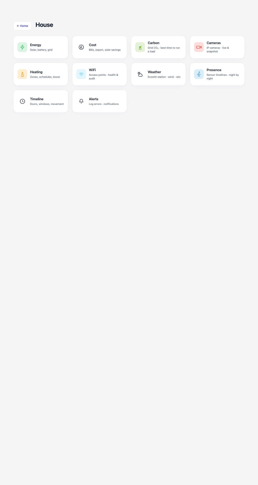

# Menu — `menu.html`



Three grouped lists — House, Rooms, Tools — reached by the hub's own House / Rooms / Tools cards.
No API key and no device poll: every tile here is a plain link, which is deliberate, because this
page costs one small request whether you are at home or on 5G.

```
menu.html?g=house    (default)
menu.html?g=rooms
menu.html?g=tools
```

## Down the page

**House.** Energy, Cost, Carbon, Cameras, Heating, Wi-Fi, Weather, Presence, Timeline and Alerts,
each with a one-line subtitle. The three Sigenergy tiles disappear when that plugin is not
installed, and Carbon follows its own region setting.

**Rooms.** Built from `rooms.json` rather than a fixed list, so a room added in Settings appears
here without touching any HTML. Each tile names how many lights are on, whether there is motion,
and how many windows are open.

**Tools.** Active, Scenes, Mains, Laundry, System, Activity, Settings, then any custom links from
Settings — the same kind of thing as a tool, so they live here rather than needing a wall of tiles
on the hub.

**Back to Home.** The only navigation the page itself offers.

## Where the numbers come from

The House and Tools tiles are a fixed table in the page. Rooms come from `rooms.json`, the same file
every other room-aware page reads.

## Refresh

Never. This page has no live data — it is pure navigation.

## What you can do here

Tap any tile to open that page or room. Nothing else.

## Worth knowing

- This is the only page that enumerates every room and every tool page.
- A room icon comes from matching the room's name against a small set of patterns (bed, kitchen,
  bathroom, garage, and so on); an unmatched name gets a plain house icon rather than an empty
  square.
