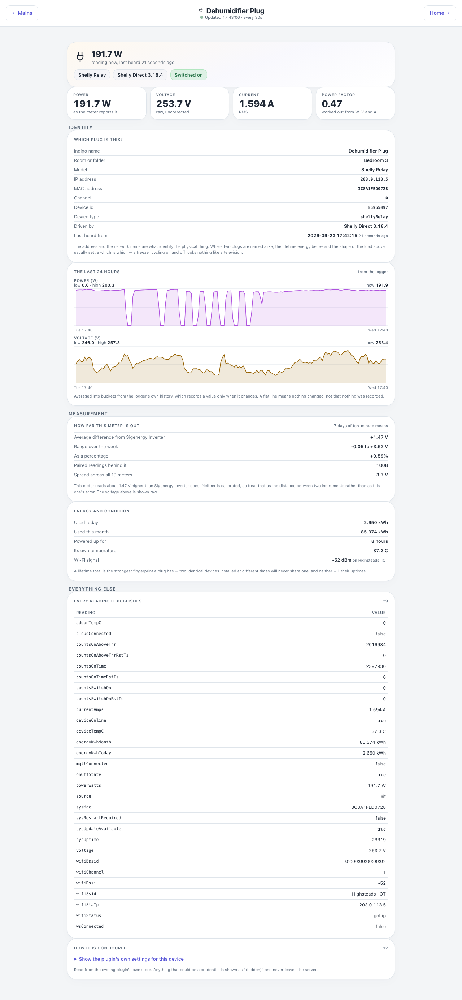

# Meter — `meter.html?id=N`



The drill-down from Mains. Which meter it shows comes from the query string, and the id is the
Indigo device id:

```
meter.html?id=123456
```

It exists because two identically named plugs can sit on a census with nothing saying which is
which — so this page leads with the things that identify a *physical* device, not just a reading.
Read-only throughout.

## Down the page

**Hero.** The name, live power in large type, and how long ago it was last heard from. A meter that
is not answering shows a dash here and moves its last reading into the sub-line as history.

**Live tiles.** Power, voltage (raw, uncorrected), current and power factor — the last marked
"worked out from W, V and A" when the meter does not report it directly.

**Identity.** Which device this actually is: Indigo name, room, model, address, channel, device id,
device type, driving plugin and version, and when it last spoke. Two identically named devices never
share an address or an uptime.

**Position.** Where this meter sits on a scale of every live meter in the house, with its rank. Only
drawn for a meter that is answering — a frozen reading cannot be placed on a scale of live ones.

**The last 24 hours.** Two charts from the SQL Logger history — power and voltage — each with its
low, high and current value. The note says plainly that a flat line means nothing changed, not that
nothing was recorded.

**How far this meter is out.** Its average difference from the reference, the range over the week,
that difference as a percentage, how many paired readings back it, and the spread across every
meter in the house. Neither instrument is calibrated, so this is a distance between two readings,
not an error. The reference is the Sigenergy inverter, so without SigenEnergyManager this card is
left out.

**Energy and condition.** Used today, used this month, how long it has been powered, its own
temperature, and its Wi-Fi signal — whichever of those the device reports.

**Everything else.** Every raw reading the device publishes, as a table. The whole of what the
plugin knows about the device, not a curated subset.

**How it is configured.** A collapsed panel showing the owning plugin's own stored settings for this
device, with anything that looks like a credential shown as "(hidden)".

## Where the numbers come from

`mainsMeter`: live tiles and identity from the Indigo device's own state; the charts and the week's
offset from the SQL Logger history, PK-ranged so a heavy query cannot stall the server.

## Refresh

Every 30 s. Identical output writes nothing to the page, so a fold you have opened stays open.

## What you can do here

Nothing — read only. Follow "Mains" back to the full census.

## Worth knowing

- A lifetime energy total and an uptime are the two figures that can never coincidentally match
  between two otherwise identical devices — use them, not the wattage, to tell two plugs apart.
- Every value on a dead meter is dashed together. Guarding the headline of a reading is not guarding
  the reading: a plug with no mains cannot be measuring 250 V, whatever its last state says.
