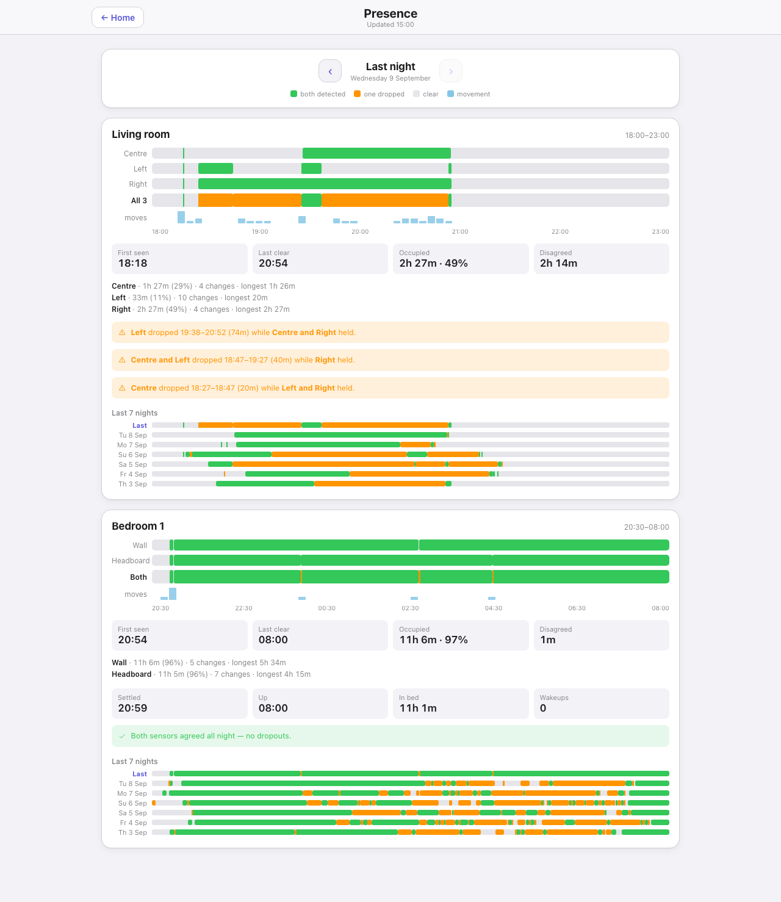

# Presence — `presence.html`

Rooms with paired presence sensors, drawn as timelines so you can see not just whether the room was
occupied but whether the two sensors agreed about it. It exists because a single radar sensor that
quietly loses a motionless body reads exactly like an empty room. Needs the `Presence_Watch.py`
companion script.

## Down the page

**Night picker.** Previous and next arrows around the night being shown, and the key: both
detected, one dropped, clear, movement.

**One card per room**, each with:

- *Per-sensor bars.* One row per sensor, then a combined "Both" row, then a "moves" row of short
  marks where the sensors reported movement. Green means both detected, amber means one dropped
  while the other held, grey means clear.
- *Four tiles.* First seen, last clear, occupied time with the percentage of the window, and total
  disagreed time.
- *Per-sensor summary lines.* Occupied time, percentage, number of state changes, and the longest
  single run, for each sensor separately. Differing change counts are the tell — one sensor being
  much twitchier than its partner on the same night.
- *Sleep tiles*, on a bedroom only: settled, up, time in bed, and the number of wakeups.
- *Verdict banners.* Green when both sensors agreed all night. Amber, one per event, naming which
  sensor dropped, for how long, and which one held through it.
- *Last 7 nights.* Seven compact bars in the same colours, so a night that went wrong stands out
  against the week.

## Where the data comes from

`presenceData`, which serves the file the `Presence_Watch.py` companion script writes — a fortnight
of room occupancy plus the bedroom sleep proxy. It is deliberately not a public file: a nightly
record of when the house is empty is not something to publish.

## Refresh

Every two minutes. The data behind it only changes when the watch script runs, so there is nothing
to gain from polling harder.

## What you can do here

Step back and forward through nights. Nothing else — it is a record, not a control.

## Worth knowing

- The amber bands are the reason the page exists. A sensor that drops for forty minutes while its
  partner holds is a sensor that would have reported an empty bedroom on its own.
- Many radar sensors keep their settings in their own firmware and revert them on a battery
  change. Watch for bands appearing where there were none: adaptive sensitivity switching itself
  back on shows up as a night that holds at first and then fragments. The `FP300_Config_Watch.py`
  companion script polices exactly this for Aqara FP300s.
- A sleeping adult's only radar signature is chest movement, so a short absence timer is far too
  short for a bedroom. Two minutes is a good starting point.
- Only rooms with paired sensors appear. A room with one sensor has nothing to disagree about and is
  not drawn.
