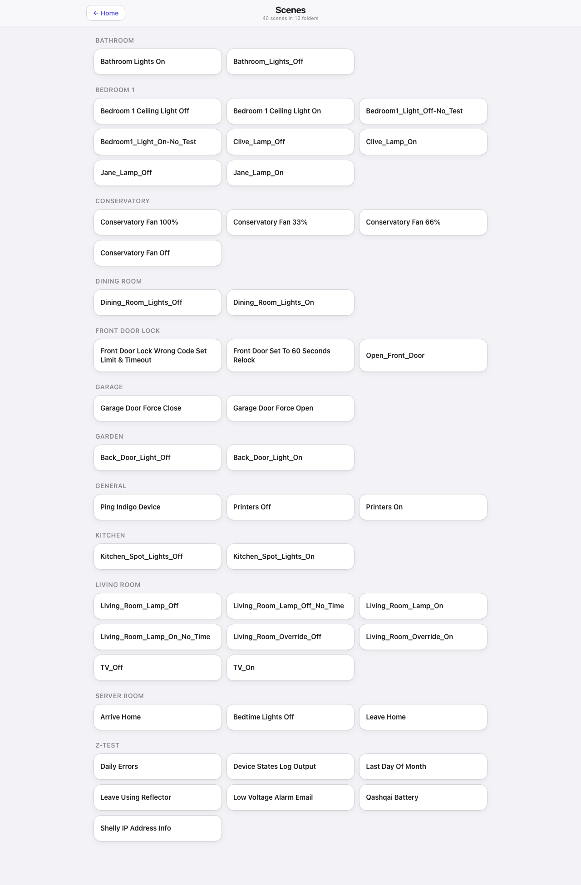

# Scenes — `scenes.html`

Every Indigo action group as a button, in its own folder. The header counts them.

## Down the page

**One block per folder**, the folder name as the heading, three buttons across. Folders are
alphabetical and the buttons inside them are too, which is why the on and off pair for the same
light usually sit next to each other.

That is the whole page. It is a launcher, not a dashboard.

## Where the data comes from

`scenes.json`, written by the plugin from Indigo's action groups and refetched every minute, so a
group added in Indigo appears here without a restart. Running one goes through Indigo's REST API.

Which scenes appear is controlled from the Settings page: a per-scene tick hides one, and a
per-folder tick hides the whole folder.

## Refresh

Every 60 s — enough to pick up a new action group, and there is nothing live on the page to update
faster.

## What you can do here

Tap a scene to run it. The button takes itself over and then watches the affected device states to
confirm it actually happened — which states confirm which action is declared per group in the
`actionWatch` configuration — rather than reporting success because the command was accepted. It
says running, done or failed. Scenes honour the PIN where they touch a PIN-protected device, and a
guest browser cannot run them.

## Worth knowing

- The names come straight from Indigo, underscores and all. If your action groups are named
  inconsistently, this is where it shows.
- Test and diagnostic groups show up here too unless hidden in Settings.
- Some action groups are one-way safety actions rather than toggles — a "force close" for a door,
  say. The confirmation rules are what stop such a button lying about what happened.
