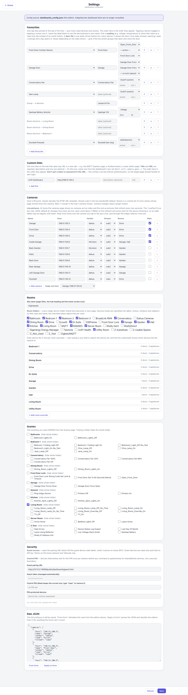

# Settings — `settings.html`

Everything the plugin's pages read from configuration, editable in the browser. The banner at the
top states where it writes: `dashboards_config.json` in the plugin's Preferences folder, which from
the first Save is the single source of truth. The full description of every key is on the
[Configuration](../configuration.md) page; this is the page itself.

## Down the page

**Favourites.** The hub's one-tap tiles, reorderable. Each row is a control, a reading, a door tile,
a room shortcut or a group, with a device or scene picker showing which device an id resolves to. A
favourite whose device no longer exists is named — "(not found: device #123456 — pick another, or
it stays as is)" — and kept until you actively choose something else. A favourite type a newer hub
understands and this editor does not rides through a save untouched rather than being dropped.

**Custom links.** Extra tiles for the menu's Tools group.

**Cameras.** One row per camera: host, name, vendor, stream, rooms, and whether it is in the hub's
strip. A swap-out host picker sits at the bottom. Camera changes need a plugin restart, and the card
says so.

**Rooms.** Which Indigo device folders become rooms, and per-room overrides. Device sections —
lights, motion, windows, radiators — are classified automatically from folders and names; this is
where you correct that. Each room shows what it currently resolves to ("1 doors · 0 appliances"),
and typing in a field searches the device list.

**Scenes.** Every action group with a tick to hide it from the Scenes page, and a per-folder tick
that hides the whole folder.

**Security.** The guest pairing URL (open it on the guest device), the guest token shown for
reference, and the control PIN — asked once per session before any command on the listed devices
(and before the Heating page's boost and force buttons when any heating zone is listed). A
speed bump for shared and family devices rather than a security boundary. The PIN field hides what
you type and is not offered to the browser's form memory. Leave it blank to keep the current PIN, or
tick *Remove the PIN* to take it away. Below it, the list of PIN-protected device ids.

**Raw JSON.** The whole configuration as it will be saved, with *From form* to regenerate it from
the editors above and *Apply to form* to parse it back. The escape hatch for anything the forms do
not cover.

**Save bar.** Fixed to the bottom: Reload and Save.

## Where the data comes from

`getDashboardsConfig` returns the effective configuration plus a device index for the pickers;
`saveDashboardsConfig` validates, writes the file and applies it live. The pickers also read
`/v2/api` for device names.

## Refresh

None. It loads once, and you save deliberately.

## What you can do here

Everything on the page is editable, and Save writes it. Camera changes need a plugin restart; the
rest apply live. Save checks the plugin is actually up first — this is the page most likely to be
opened right after a restart.

## Worth knowing

- The page shows what is *saved*, not what is running. Reopen it after adding a camera and the new
  camera is in the list, whether or not the plugin has restarted yet.
- Room overrides are the fix for a device the classifier put in the wrong section. Read the resolved
  counts under each room before assuming a page is broken.
- The screenshot above has its token blanked: anything labelled token, key, PIN or password is
  masked on the way to the capture.
