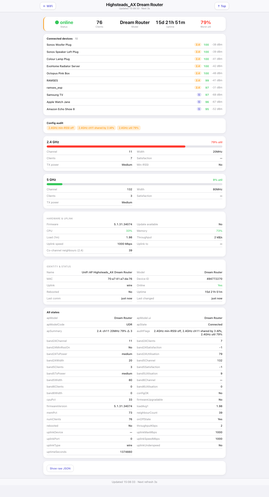

# Wi-Fi AP — `wifi-ap.html?id=N`

The drill-down from the Wi-Fi page. Which AP it shows comes from the query string, and the id is the
Indigo device id of the AP. Reached by tapping the chevron on an AP card.

## Down the page

**Summary strip.** Online status, client count, model, uptime, and worst band utilisation.

**Connected devices.** Every client on this AP: name, a band badge, satisfaction score and signal.
This is the list that answers "why is that plug unhappy" — a client at −67 dBm on 2.4 GHz is on the
wrong AP or behind too many walls.

**Config audit.** The findings for this AP as amber pills, the same ones summarised on the Wi-Fi
page.

**One card per band.** A utilisation bar, then channel, width, client count, satisfaction, transmit
power, and whether min-RSSI is enabled. Bands the AP does not have are simply absent.

**Hardware & uplink.** Firmware version and whether an update is waiting, CPU, memory, load,
throughput, uplink speed, what it is uplinked to and on which port, and the co-channel neighbour
count.

**Identity & status.** Name, model, address, Indigo device id, uplink type, online flag, whether it
has rebooted, uptime, last communication and last change.

**All states.** Every state on the underlying Indigo device, raw. The escape hatch for anything the
cards above do not show.

## Where the data comes from

One Indigo device, published by the UniFiHealth plugin, read through `/v2/api`.

## Refresh

Every second.

## What you can do here

Read, and go back to the Wi-Fi page. No controls.

## Worth knowing

- "Uplink to" naming the switch and port is the useful bit when an AP goes slow. An underspeed
  uplink shows here before it shows anywhere else.
- The "All states" card is worth scrolling to when the plugin gains a state the page has not been
  taught to render yet — nothing goes missing, it lands there instead.
- A UniFi router counts as an access point for this page, which is why it appears alongside the
  others.
