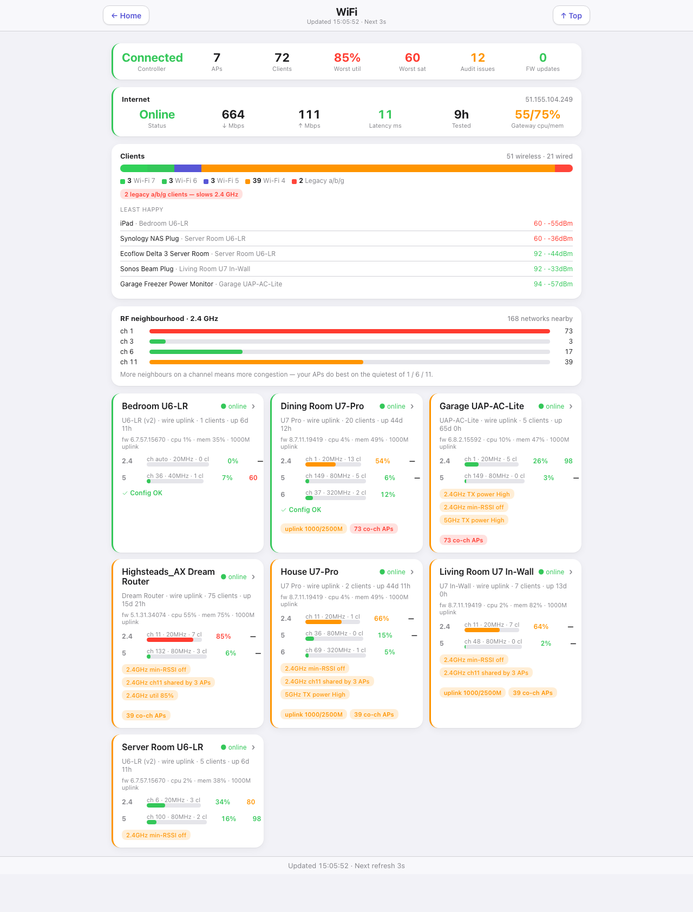

# Wi-Fi — `wifi.html`

Every access point, every client, and the two things that actually degrade a home network: channel
congestion and one old client dragging a band down. **Needs the UniFiHealth plugin** (v0.2.0 or
later); nothing here talks to the controller directly.

## Down the page

**Summary strip.** Controller state, AP count, client count, worst utilisation, worst satisfaction,
open audit issues, and firmware updates pending. Each figure is coloured by severity, so a red
utilisation is visible before you read the label.

**Internet.** WAN status, the last speed test down and up, latency, how long ago it was tested, the
gateway's CPU and memory, and the public address.

**Clients.** Wireless and wired counts, then a stacked bar of the Wi-Fi generation mix — 7, 6, 5, 4
and legacy — with a warning pill when a legacy client is present, because one a/b/g client slows
the whole 2.4 GHz band. Below that, "least happy": the five clients with the worst satisfaction,
each with the AP it is on, its score and its signal.

**RF neighbourhood, 2.4 GHz.** How many networks are visible on each channel, with the total nearby
count, and what to do with it: the APs do best on the quietest of 1, 6 and 11.

**AP cards.** One per access point. Each gives the model, uplink type, client count and uptime;
firmware version, CPU, memory and uplink speed; then a row per band with channel, width, client
count, utilisation and transmit power. Underneath, amber pills for every audit finding and a red
pill for co-channel neighbour counts. A chevron opens the AP's own page. An AP whose controller has
gone unreachable is marked stale with its last-update time, rather than presenting a stopped clock
as "online".

## Where the data comes from

Indigo devices published by the UniFiHealth plugin, read through `/v2/api`. The plugin does the
polling, the audit and the neighbour counts; this page renders its device states.

## Refresh

Every second.

## What you can do here

Open any [AP's detail page](wifi-ap.md). Read-only otherwise — configuration changes belong in the
UniFi controller.

## Worth knowing

- The audit pills are opinions, not faults. "min-RSSI off" is a setting UniFi ships off by default;
  the plugin flags it because turning it on is usually right in a multi-AP house.
- Co-channel counts are neighbours, not your own kit. Dozens of networks on channel 6 is why the
  2.4 GHz utilisation numbers look the way they do.
- Utilisation is the number that predicts complaints. A congested band stays congested however good
  the signal is, and moving one stubborn device to 5 GHz usually helps more than moving the AP.
- An AP going offline briefly during a firmware upgrade is normal; the plugin debounces it with a
  configurable grace period.
